# Starlight Icons by Category ✨

<!-- ⚠️ AUTO-GENERATED FILE
This README.md is automatically generated from configuration and data files.
Do not edit manually. See CONTRIBUTING.md for details on updating categories or regenerating content.
-->

🖌️ Quickly find the perfect icon for your Astro Starlight components.

This [snippet](https://github.com/apathetic-tools/snippets) *(but not the icons themselves)*  was created by 😐 [Apathetic Tools](https://github.com/apathetic-tools), with thanks to [Starlight](https://starlight.astro.build/) for the original reference.  
Guide licensed [CC BY-NC](../../../../LICENSE-CONTENT) · Code snippets [MIT](../../../../LICENSE)

> [!IMPORTANT]  
> Many icons are trademarked or strongly tied to a specific brand, product, or technology. Only use them when representing their intended meaning.

## 💡Why categorize them? What are the alternatives?

The [Astro Starlight](https://starlight.astro.build/) integration only supports built-in icon types. Its documentation includes a complete [built-in icon reference](https://starlight.astro.build/reference/icons/#all-icons), but with hundreds of icons—many of which cannot be used freely—it can be difficult to find the one you need.

> [!TIP]
> For alternate solutions—supporting any custom SVG icon, icon set, or even UTF-8 Emoji—see our tips after the categorized built-in icons list.

We've organized the Starlight built-in icons into categories for you below.

## Built-in Icons

### Navigation & Arrows

<small>*General Use*</small>

| |  |  | |
|:---:|:------:|:------:|:---:|
| 

 | 

 | 

 | 

 |
| 
&nbsp;&nbsp;&nbsp;&nbsp;up-caret ℹ
 | 
&nbsp;&nbsp;&nbsp;&nbsp;down-caret ℹ
 | 
&nbsp;&nbsp;&nbsp;&nbsp;left-caret ℹ
 | 
&nbsp;&nbsp;&nbsp;&nbsp;right-caret ℹ
 |
| 

 | 

 | 

 | 

 |
| 
&nbsp;&nbsp;&nbsp;&nbsp;up-arrow ℹ
 | 
&nbsp;&nbsp;&nbsp;&nbsp;down-arrow ℹ
 | 
&nbsp;&nbsp;&nbsp;&nbsp;left-arrow ℹ
 | 
&nbsp;&nbsp;&nbsp;&nbsp;right-arrow ℹ
 |
| 

 | 

 | 

 |   |
| 
&nbsp;&nbsp;&nbsp;&nbsp;bars ℹ
 | 
&nbsp;&nbsp;&nbsp;&nbsp;forward-slash ℹ
 | 
&nbsp;&nbsp;&nbsp;&nbsp;close ℹ
 |   |

### Actions & Editing

<small>*General Use*</small>

| |  |  | |
|:---:|:------:|:------:|:---:|
| 

 | 

 | 

 | 

 |
| 
&nbsp;&nbsp;&nbsp;&nbsp;pencil ℹ
 | 
&nbsp;&nbsp;&nbsp;&nbsp;pen ℹ
 | 
&nbsp;&nbsp;&nbsp;&nbsp;document ℹ
 | 
&nbsp;&nbsp;&nbsp;&nbsp;add-document ℹ
 |
| 

 | 

 | 

 | 

 |
| 
&nbsp;&nbsp;&nbsp;&nbsp;setting ℹ
 | 
&nbsp;&nbsp;&nbsp;&nbsp;external ℹ
 | 
&nbsp;&nbsp;&nbsp;&nbsp;download ℹ
 | 
&nbsp;&nbsp;&nbsp;&nbsp;cloud-download ℹ
 |
| 

 | 

 | 

 | 

 |
| 
&nbsp;&nbsp;&nbsp;&nbsp;rocket ℹ
 | 
&nbsp;&nbsp;&nbsp;&nbsp;star ℹ
 | 
&nbsp;&nbsp;&nbsp;&nbsp;puzzle ℹ
 | 
&nbsp;&nbsp;&nbsp;&nbsp;list-format ℹ
 |
| 

 | 

 | 

 | 

 |
| 
&nbsp;&nbsp;&nbsp;&nbsp;random ℹ
 | 
&nbsp;&nbsp;&nbsp;&nbsp;comment ℹ
 | 
&nbsp;&nbsp;&nbsp;&nbsp;comment-alt ℹ
 | 
&nbsp;&nbsp;&nbsp;&nbsp;approve-check ℹ
 |
| 

 | 

 | 

 |   |
| 
&nbsp;&nbsp;&nbsp;&nbsp;approve-check-circle ℹ
 | 
&nbsp;&nbsp;&nbsp;&nbsp;translate ℹ
 | 
&nbsp;&nbsp;&nbsp;&nbsp;heart ℹ
 |   |

### Content, Status & System

<small>*General Use*</small>

| |  |  | |
|:---:|:------:|:------:|:---:|
| 

 | 

 | 

 | 

 |
| 
&nbsp;&nbsp;&nbsp;&nbsp;moon ℹ
 | 
&nbsp;&nbsp;&nbsp;&nbsp;sun ℹ
 | 
&nbsp;&nbsp;&nbsp;&nbsp;laptop ℹ
 | 
&nbsp;&nbsp;&nbsp;&nbsp;open-book ℹ
 |
| 

 | 

 | 

 | 

 |
| 
&nbsp;&nbsp;&nbsp;&nbsp;information ℹ
 | 
&nbsp;&nbsp;&nbsp;&nbsp;magnifier ℹ
 | 
&nbsp;&nbsp;&nbsp;&nbsp;&nbsp;&nbsp;&nbsp;&nbsp;seti:image ℹ <a href="https://github.com/jesseweed/seti-ui/blob/master/icons/image.svg">🔗</a>
 | 
&nbsp;&nbsp;&nbsp;&nbsp;&nbsp;&nbsp;&nbsp;&nbsp;seti:video ℹ <a href="https://github.com/jesseweed/seti-ui/blob/master/icons/video.svg">🔗</a>
 |
| 

 | 

 | 

 | 

 |
| 
&nbsp;&nbsp;&nbsp;&nbsp;&nbsp;&nbsp;&nbsp;&nbsp;seti:audio ℹ <a href="https://github.com/jesseweed/seti-ui/blob/master/icons/audio.svg">🔗</a>
 | 
&nbsp;&nbsp;&nbsp;&nbsp;&nbsp;&nbsp;&nbsp;&nbsp;seti:todo ℹ <a href="https://github.com/jesseweed/seti-ui/blob/master/icons/todo.svg">🔗</a>
 | 
&nbsp;&nbsp;&nbsp;&nbsp;&nbsp;&nbsp;&nbsp;&nbsp;seti:plan ℹ <a href="https://github.com/jesseweed/seti-ui/blob/master/icons/plan.svg">🔗</a>
 | 
&nbsp;&nbsp;&nbsp;&nbsp;&nbsp;&nbsp;&nbsp;&nbsp;seti:pipeline ℹ <a href="https://github.com/jesseweed/seti-ui/blob/master/icons/pipeline.svg">🔗</a>
 |
| 

 | 

 | 

 | 

 |
| 
&nbsp;&nbsp;&nbsp;&nbsp;&nbsp;&nbsp;&nbsp;&nbsp;seti:happenings ℹ <a href="https://github.com/jesseweed/seti-ui/blob/master/icons/happenings.svg">🔗</a>
 | 
&nbsp;&nbsp;&nbsp;&nbsp;&nbsp;&nbsp;&nbsp;&nbsp;seti:lock ℹ <a href="https://github.com/jesseweed/seti-ui/blob/master/icons/lock.svg">🔗</a>
 | 
&nbsp;&nbsp;&nbsp;&nbsp;&nbsp;&nbsp;&nbsp;&nbsp;seti:license ℹ <a href="https://github.com/jesseweed/seti-ui/blob/master/icons/license.svg">🔗</a>
 | 
&nbsp;&nbsp;&nbsp;&nbsp;&nbsp;&nbsp;&nbsp;&nbsp;seti:code-search ℹ <a href="https://github.com/jesseweed/seti-ui/blob/master/icons/code-search.svg">🔗</a>
 |
| 

 | 

 | 

 | 

 |
| 
&nbsp;&nbsp;&nbsp;&nbsp;email ℹ
 | 
&nbsp;&nbsp;&nbsp;&nbsp;phone ℹ
 | 
&nbsp;&nbsp;&nbsp;&nbsp;&nbsp;&nbsp;&nbsp;&nbsp;seti:folder ℹ <a href="https://github.com/jesseweed/seti-ui/blob/master/icons/folder.svg">🔗</a>
 | 
&nbsp;&nbsp;&nbsp;&nbsp;&nbsp;&nbsp;&nbsp;&nbsp;seti:config ℹ <a href="https://github.com/jesseweed/seti-ui/blob/master/icons/config.svg">🔗</a>
 |
| 

 | 

 | 

 | 

 |
| 
&nbsp;&nbsp;&nbsp;&nbsp;&nbsp;&nbsp;&nbsp;&nbsp;seti:favicon ℹ <a href="https://github.com/jesseweed/seti-ui/blob/master/icons/favicon.svg">🔗</a>
 | 
&nbsp;&nbsp;&nbsp;&nbsp;&nbsp;&nbsp;&nbsp;&nbsp;seti:info ℹ <a href="https://github.com/jesseweed/seti-ui/blob/master/icons/info.svg">🔗</a>
 | 
&nbsp;&nbsp;&nbsp;&nbsp;&nbsp;&nbsp;&nbsp;&nbsp;seti:clock ℹ <a href="https://github.com/jesseweed/seti-ui/blob/master/icons/clock.svg">🔗</a>
 | 
&nbsp;&nbsp;&nbsp;&nbsp;&nbsp;&nbsp;&nbsp;&nbsp;seti:notebook ℹ <a href="https://github.com/jesseweed/seti-ui/blob/master/icons/notebook.svg">🔗</a>
 |
| 

 | 

 | 

 | 

 |
| 
&nbsp;&nbsp;&nbsp;&nbsp;&nbsp;&nbsp;&nbsp;&nbsp;seti:db ℹ <a href="https://github.com/jesseweed/seti-ui/blob/master/icons/db.svg">🔗</a>
 | 
&nbsp;&nbsp;&nbsp;&nbsp;&nbsp;&nbsp;&nbsp;&nbsp;seti:default ℹ <a href="https://github.com/jesseweed/seti-ui/blob/master/icons/default.svg">🔗</a>
 | 
&nbsp;&nbsp;&nbsp;&nbsp;&nbsp;&nbsp;&nbsp;&nbsp;seti:shell ℹ <a href="https://github.com/jesseweed/seti-ui/blob/master/icons/shell.svg">🔗</a>
 | 
&nbsp;&nbsp;&nbsp;&nbsp;&nbsp;&nbsp;&nbsp;&nbsp;seti:ignored ℹ <a href="https://github.com/jesseweed/seti-ui/blob/master/icons/ignored.svg">🔗</a>
 |
| 

 | 

 |   |   |
| 
&nbsp;&nbsp;&nbsp;&nbsp;error ℹ
 | 
&nbsp;&nbsp;&nbsp;&nbsp;warning ℹ
 |   |   |

### Programming & Scripting Languages

| |  |  | |
|:---:|:------:|:------:|:---:|
| 

 | 

 | 

 | 
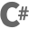
 |
| 
&nbsp;&nbsp;&nbsp;&nbsp;&nbsp;&nbsp;&nbsp;&nbsp;<a href="https://argdown.org/">seti:argdown</a> ℹ <a href="https://github.com/jesseweed/seti-ui/blob/master/icons/argdown.svg">🔗</a>
 | 
&nbsp;&nbsp;&nbsp;&nbsp;&nbsp;&nbsp;&nbsp;&nbsp;<a href="https://en.wikipedia.org/wiki/Assembly_language">seti:asm</a> ℹ <a href="https://github.com/jesseweed/seti-ui/blob/master/icons/asm.svg">🔗</a>
 | 
&nbsp;&nbsp;&nbsp;&nbsp;&nbsp;&nbsp;&nbsp;&nbsp;<a href="https://www.c-language.org/">seti:c</a> ℹ <a href="https://github.com/jesseweed/seti-ui/blob/master/icons/c.svg">🔗</a>
 | 
&nbsp;&nbsp;&nbsp;&nbsp;&nbsp;&nbsp;&nbsp;&nbsp;<a href="https://learn.microsoft.com/en-us/dotnet/csharp/">seti:c-sharp</a> ℹ <a href="https://github.com/jesseweed/seti-ui/blob/master/icons/c-sharp.svg">🔗</a>
 |
| 

 | 

 | 
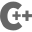
 | 

 |
| 
&nbsp;&nbsp;&nbsp;&nbsp;&nbsp;&nbsp;&nbsp;&nbsp;<a href="https://clojure.org/">seti:clojure</a> ℹ <a href="https://github.com/jesseweed/seti-ui/blob/master/icons/clojure.svg">🔗</a>
 | 
&nbsp;&nbsp;&nbsp;&nbsp;&nbsp;&nbsp;&nbsp;&nbsp;<a href="https://www.adobe.com/products/coldfusion-family.html">seti:coldfusion</a> ℹ <a href="https://github.com/jesseweed/seti-ui/blob/master/icons/coldfusion.svg">🔗</a>
 | 
&nbsp;&nbsp;&nbsp;&nbsp;&nbsp;&nbsp;&nbsp;&nbsp;<a href="https://isocpp.org/">seti:cpp</a> ℹ <a href="https://github.com/jesseweed/seti-ui/blob/master/icons/cpp.svg">🔗</a>
 | 
&nbsp;&nbsp;&nbsp;&nbsp;&nbsp;&nbsp;&nbsp;&nbsp;<a href="https://crystal-lang.org/">seti:crystal</a> ℹ <a href="https://github.com/jesseweed/seti-ui/blob/master/icons/crystal.svg">🔗</a>
 |
| 

 | 

 | 

 | 

 |
| 
&nbsp;&nbsp;&nbsp;&nbsp;&nbsp;&nbsp;&nbsp;&nbsp;<a href="https://crystal-lang.org/">seti:crystal_embedded</a> ℹ <a href="https://github.com/jesseweed/seti-ui/blob/master/icons/crystal_embedded.svg">🔗</a>
 | 
&nbsp;&nbsp;&nbsp;&nbsp;&nbsp;&nbsp;&nbsp;&nbsp;<a href="https://dlang.org/">seti:d</a> ℹ <a href="https://github.com/jesseweed/seti-ui/blob/master/icons/d.svg">🔗</a>
 | 
&nbsp;&nbsp;&nbsp;&nbsp;&nbsp;&nbsp;&nbsp;&nbsp;<a href="https://dart.dev/">seti:dart</a> ℹ <a href="https://github.com/jesseweed/seti-ui/blob/master/icons/dart.svg">🔗</a>
 | 
&nbsp;&nbsp;&nbsp;&nbsp;&nbsp;&nbsp;&nbsp;&nbsp;<a href="https://elixir-lang.org/">seti:elixir</a> ℹ <a href="https://github.com/jesseweed/seti-ui/blob/master/icons/elixir.svg">🔗</a>
 |
| 

 | 

 | 

 | 

 |
| 
&nbsp;&nbsp;&nbsp;&nbsp;&nbsp;&nbsp;&nbsp;&nbsp;<a href="https://elm-lang.org/">seti:elm</a> ℹ <a href="https://github.com/jesseweed/seti-ui/blob/master/icons/elm.svg">🔗</a>
 | 
&nbsp;&nbsp;&nbsp;&nbsp;&nbsp;&nbsp;&nbsp;&nbsp;<a href="https://learn.microsoft.com/en-us/dotnet/fsharp/">seti:f-sharp</a> ℹ <a href="https://github.com/jesseweed/seti-ui/blob/master/icons/f-sharp.svg">🔗</a>
 | 
&nbsp;&nbsp;&nbsp;&nbsp;&nbsp;&nbsp;&nbsp;&nbsp;<a href="https://golang.org/">seti:go</a> ℹ <a href="https://github.com/jesseweed/seti-ui/blob/master/icons/go.svg">🔗</a>
 | 
&nbsp;&nbsp;&nbsp;&nbsp;&nbsp;&nbsp;&nbsp;&nbsp;<a href="https://graphql.org/">seti:graphql</a> ℹ <a href="https://github.com/jesseweed/seti-ui/blob/master/icons/graphql.svg">🔗</a>
 |
| 

 | 

 | 

 | 

 |
| 
&nbsp;&nbsp;&nbsp;&nbsp;&nbsp;&nbsp;&nbsp;&nbsp;<a href="https://hacklang.org/">seti:hacklang</a> ℹ <a href="https://github.com/jesseweed/seti-ui/blob/master/icons/hacklang.svg">🔗</a>
 | 
&nbsp;&nbsp;&nbsp;&nbsp;&nbsp;&nbsp;&nbsp;&nbsp;<a href="https://www.haskell.org/">seti:haskell</a> ℹ <a href="https://github.com/jesseweed/seti-ui/blob/master/icons/haskell.svg">🔗</a>
 | 
&nbsp;&nbsp;&nbsp;&nbsp;&nbsp;&nbsp;&nbsp;&nbsp;<a href="https://haxe.org/">seti:haxe</a> ℹ <a href="https://github.com/jesseweed/seti-ui/blob/master/icons/haxe.svg">🔗</a>
 | 
&nbsp;&nbsp;&nbsp;&nbsp;&nbsp;&nbsp;&nbsp;&nbsp;<a href="https://www.java.com/">seti:java</a> ℹ <a href="https://github.com/jesseweed/seti-ui/blob/master/icons/java.svg">🔗</a>
 |
| 

 | 

 | 

 | 

 |
| 
&nbsp;&nbsp;&nbsp;&nbsp;&nbsp;&nbsp;&nbsp;&nbsp;<a href="https://developer.mozilla.org/en-US/docs/Web/JavaScript">seti:javascript</a> ℹ <a href="https://github.com/jesseweed/seti-ui/blob/master/icons/javascript.svg">🔗</a>
 | 
&nbsp;&nbsp;&nbsp;&nbsp;&nbsp;&nbsp;&nbsp;&nbsp;<a href="https://julialang.org/">seti:julia</a> ℹ <a href="https://github.com/jesseweed/seti-ui/blob/master/icons/julia.svg">🔗</a>
 | 
&nbsp;&nbsp;&nbsp;&nbsp;&nbsp;&nbsp;&nbsp;&nbsp;<a href="https://kotlinlang.org/">seti:kotlin</a> ℹ <a href="https://github.com/jesseweed/seti-ui/blob/master/icons/kotlin.svg">🔗</a>
 | 
&nbsp;&nbsp;&nbsp;&nbsp;&nbsp;&nbsp;&nbsp;&nbsp;<a href="https://livescript.net/">seti:livescript</a> ℹ <a href="https://github.com/jesseweed/seti-ui/blob/master/icons/livescript.svg">🔗</a>
 |
| 

 | 

 | 

 | 

 |
| 
&nbsp;&nbsp;&nbsp;&nbsp;&nbsp;&nbsp;&nbsp;&nbsp;<a href="https://www.lua.org/">seti:lua</a> ℹ <a href="https://github.com/jesseweed/seti-ui/blob/master/icons/lua.svg">🔗</a>
 | 
&nbsp;&nbsp;&nbsp;&nbsp;&nbsp;&nbsp;&nbsp;&nbsp;<a href="https://nim-lang.org/">seti:nim</a> ℹ <a href="https://github.com/jesseweed/seti-ui/blob/master/icons/nim.svg">🔗</a>
 | 
&nbsp;&nbsp;&nbsp;&nbsp;&nbsp;&nbsp;&nbsp;&nbsp;<a href="https://ocaml.org/">seti:ocaml</a> ℹ <a href="https://github.com/jesseweed/seti-ui/blob/master/icons/ocaml.svg">🔗</a>
 | 
&nbsp;&nbsp;&nbsp;&nbsp;&nbsp;&nbsp;&nbsp;&nbsp;<a href="https://en.wikipedia.org/wiki/Planning_Domain_Definition_Language">seti:pddl</a> ℹ <a href="https://github.com/jesseweed/seti-ui/blob/master/icons/pddl.svg">🔗</a>
 |
| 
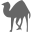
 | 

 | 

 | 

 |
| 
&nbsp;&nbsp;&nbsp;&nbsp;&nbsp;&nbsp;&nbsp;&nbsp;<a href="https://www.perl.org/">seti:perl</a> ℹ <a href="https://github.com/jesseweed/seti-ui/blob/master/icons/perl.svg">🔗</a>
 | 
&nbsp;&nbsp;&nbsp;&nbsp;&nbsp;&nbsp;&nbsp;&nbsp;<a href="https://www.php.net/">seti:php</a> ℹ <a href="https://github.com/jesseweed/seti-ui/blob/master/icons/php.svg">🔗</a>
 | 
&nbsp;&nbsp;&nbsp;&nbsp;&nbsp;&nbsp;&nbsp;&nbsp;<a href="https://learn.microsoft.com/powershell/">seti:powershell</a> ℹ <a href="https://github.com/jesseweed/seti-ui/blob/master/icons/powershell.svg">🔗</a>
 | 
&nbsp;&nbsp;&nbsp;&nbsp;&nbsp;&nbsp;&nbsp;&nbsp;<a href="https://www.swi-prolog.org/">seti:prolog</a> ℹ <a href="https://github.com/jesseweed/seti-ui/blob/master/icons/prolog.svg">🔗</a>
 |
| 

 | 

 | 

 | 

 |
| 
&nbsp;&nbsp;&nbsp;&nbsp;&nbsp;&nbsp;&nbsp;&nbsp;<a href="https://www.purescript.org/">seti:purescript</a> ℹ <a href="https://github.com/jesseweed/seti-ui/blob/master/icons/purescript.svg">🔗</a>
 | 
&nbsp;&nbsp;&nbsp;&nbsp;&nbsp;&nbsp;&nbsp;&nbsp;<a href="https://www.python.org/">seti:python</a> ℹ <a href="https://github.com/jesseweed/seti-ui/blob/master/icons/python.svg">🔗</a>
 | 
&nbsp;&nbsp;&nbsp;&nbsp;&nbsp;&nbsp;&nbsp;&nbsp;<a href="https://www.r-project.org/">seti:R</a> ℹ <a href="https://github.com/jesseweed/seti-ui/blob/master/icons/R.svg">🔗</a>
 | 
&nbsp;&nbsp;&nbsp;&nbsp;&nbsp;&nbsp;&nbsp;&nbsp;<a href="https://rescript-lang.org/">seti:rescript</a> ℹ <a href="https://github.com/jesseweed/seti-ui/blob/master/icons/rescript.svg">🔗</a>
 |
| 

 | 

 | 

 | 

 |
| 
&nbsp;&nbsp;&nbsp;&nbsp;&nbsp;&nbsp;&nbsp;&nbsp;<a href="https://www.ruby-lang.org/">seti:ruby</a> ℹ <a href="https://github.com/jesseweed/seti-ui/blob/master/icons/ruby.svg">🔗</a>
 | 
&nbsp;&nbsp;&nbsp;&nbsp;&nbsp;&nbsp;&nbsp;&nbsp;<a href="https://www.rust-lang.org/">seti:rust</a> ℹ <a href="https://github.com/jesseweed/seti-ui/blob/master/icons/rust.svg">🔗</a>
 | 
&nbsp;&nbsp;&nbsp;&nbsp;&nbsp;&nbsp;&nbsp;&nbsp;<a href="https://www.scala-lang.org/">seti:scala</a> ℹ <a href="https://github.com/jesseweed/seti-ui/blob/master/icons/scala.svg">🔗</a>
 | 
&nbsp;&nbsp;&nbsp;&nbsp;&nbsp;&nbsp;&nbsp;&nbsp;<a href="https://swift.org/">seti:swift</a> ℹ <a href="https://github.com/jesseweed/seti-ui/blob/master/icons/swift.svg">🔗</a>
 |
| 

 | 

 | 

 |   |
| 
&nbsp;&nbsp;&nbsp;&nbsp;&nbsp;&nbsp;&nbsp;&nbsp;<a href="https://www.typescriptlang.org/">seti:typescript</a> ℹ <a href="https://github.com/jesseweed/seti-ui/blob/master/icons/typescript.svg">🔗</a>
 | 
&nbsp;&nbsp;&nbsp;&nbsp;&nbsp;&nbsp;&nbsp;&nbsp;<a href="https://vala.dev/">seti:vala</a> ℹ <a href="https://github.com/jesseweed/seti-ui/blob/master/icons/vala.svg">🔗</a>
 | 
&nbsp;&nbsp;&nbsp;&nbsp;&nbsp;&nbsp;&nbsp;&nbsp;<a href="https://ziglang.org/">seti:zig</a> ℹ <a href="https://github.com/jesseweed/seti-ui/blob/master/icons/zig.svg">🔗</a>
 |   |

### Web & Markup

| |  |  | |
|:---:|:------:|:------:|:---:|
| 

 | 

 | 

 | 

 |
| 
&nbsp;&nbsp;&nbsp;&nbsp;&nbsp;&nbsp;&nbsp;&nbsp;<a href="https://www.w3.org/Style/CSS/Overview.en.html">seti:css</a> ℹ <a href="https://github.com/jesseweed/seti-ui/blob/master/icons/css.svg">🔗</a>
 | 
&nbsp;&nbsp;&nbsp;&nbsp;&nbsp;&nbsp;&nbsp;&nbsp;<a href="http://haml.info/">seti:haml</a> ℹ <a href="https://github.com/jesseweed/seti-ui/blob/master/icons/haml.svg">🔗</a>
 | 
&nbsp;&nbsp;&nbsp;&nbsp;&nbsp;&nbsp;&nbsp;&nbsp;<a href="https://html.spec.whatwg.org/">seti:html</a> ℹ <a href="https://github.com/jesseweed/seti-ui/blob/master/icons/html.svg">🔗</a>
 | 
&nbsp;&nbsp;&nbsp;&nbsp;&nbsp;&nbsp;&nbsp;&nbsp;<a href="https://pugjs.org/">seti:jade</a> ℹ <a href="https://github.com/jesseweed/seti-ui/blob/master/icons/jade.svg">🔗</a>
 |
| 

 | 

 | 

 | 

 |
| 
&nbsp;&nbsp;&nbsp;&nbsp;&nbsp;&nbsp;&nbsp;&nbsp;<a href="https://palletsprojects.com/p/jinja/">seti:jinja</a> ℹ <a href="https://github.com/jesseweed/seti-ui/blob/master/icons/jinja.svg">🔗</a>
 | 
&nbsp;&nbsp;&nbsp;&nbsp;&nbsp;&nbsp;&nbsp;&nbsp;<a href="https://www.json.org/">seti:json</a> ℹ <a href="https://github.com/jesseweed/seti-ui/blob/master/icons/json.svg">🔗</a>
 | 
&nbsp;&nbsp;&nbsp;&nbsp;&nbsp;&nbsp;&nbsp;&nbsp;<a href="https://daringfireball.net/projects/markdown/">seti:markdown</a> ℹ <a href="https://github.com/jesseweed/seti-ui/blob/master/icons/markdown.svg">🔗</a>
 | 
&nbsp;&nbsp;&nbsp;&nbsp;<a href="https://mdxjs.com/">mdx</a> ℹ
 |
| 

 | 

 | 

 | 

 |
| 
&nbsp;&nbsp;&nbsp;&nbsp;&nbsp;&nbsp;&nbsp;&nbsp;<a href="https://mustache.github.io/">seti:mustache</a> ℹ <a href="https://github.com/jesseweed/seti-ui/blob/master/icons/mustache.svg">🔗</a>
 | 
&nbsp;&nbsp;&nbsp;&nbsp;&nbsp;&nbsp;&nbsp;&nbsp;<a href="https://mozilla.github.io/nunjucks/">seti:nunjucks</a> ℹ <a href="https://github.com/jesseweed/seti-ui/blob/master/icons/nunjucks.svg">🔗</a>
 | 
&nbsp;&nbsp;&nbsp;&nbsp;&nbsp;&nbsp;&nbsp;&nbsp;<a href="https://pugjs.org/">seti:pug</a> ℹ <a href="https://github.com/jesseweed/seti-ui/blob/master/icons/pug.svg">🔗</a>
 | 
&nbsp;&nbsp;&nbsp;&nbsp;&nbsp;&nbsp;&nbsp;&nbsp;<a href="https://shopify.github.io/liquid/">seti:liquid</a> ℹ <a href="https://github.com/jesseweed/seti-ui/blob/master/icons/liquid.svg">🔗</a>
 |
| 

 | 

 | 

 | 

 |
| 
&nbsp;&nbsp;&nbsp;&nbsp;&nbsp;&nbsp;&nbsp;&nbsp;<a href="https://sass-lang.com/">seti:sass</a> ℹ <a href="https://github.com/jesseweed/seti-ui/blob/master/icons/sass.svg">🔗</a>
 | 
&nbsp;&nbsp;&nbsp;&nbsp;&nbsp;&nbsp;&nbsp;&nbsp;<a href="http://slim-lang.com/">seti:slim</a> ℹ <a href="https://github.com/jesseweed/seti-ui/blob/master/icons/slim.svg">🔗</a>
 | 
&nbsp;&nbsp;&nbsp;&nbsp;&nbsp;&nbsp;&nbsp;&nbsp;<a href="https://www.smarty.net/">seti:smarty</a> ℹ <a href="https://github.com/jesseweed/seti-ui/blob/master/icons/smarty.svg">🔗</a>
 | 
&nbsp;&nbsp;&nbsp;&nbsp;&nbsp;&nbsp;&nbsp;&nbsp;<a href="https://stylus-lang.com/">seti:stylus</a> ℹ <a href="https://github.com/jesseweed/seti-ui/blob/master/icons/stylus.svg">🔗</a>
 |
| 
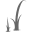
 | 

 | 

 |   |
| 
&nbsp;&nbsp;&nbsp;&nbsp;&nbsp;&nbsp;&nbsp;&nbsp;<a href="https://twig.symfony.com/">seti:twig</a> ℹ <a href="https://github.com/jesseweed/seti-ui/blob/master/icons/twig.svg">🔗</a>
 | 
&nbsp;&nbsp;&nbsp;&nbsp;&nbsp;&nbsp;&nbsp;&nbsp;<a href="https://www.w3.org/XML/">seti:xml</a> ℹ <a href="https://github.com/jesseweed/seti-ui/blob/master/icons/xml.svg">🔗</a>
 | 
&nbsp;&nbsp;&nbsp;&nbsp;&nbsp;&nbsp;&nbsp;&nbsp;<a href="https://yaml.org/">seti:yml</a> ℹ <a href="https://github.com/jesseweed/seti-ui/blob/master/icons/yml.svg">🔗</a>
 |   |

### Frameworks & Tools

| |  |  | |
|:---:|:------:|:------:|:---:|
| 

 | 

 | 

 | 

 |
| 
&nbsp;&nbsp;&nbsp;&nbsp;<a href="https://alpinejs.dev/">alpine</a> ℹ
 | 
&nbsp;&nbsp;&nbsp;&nbsp;&nbsp;&nbsp;&nbsp;&nbsp;<a href="https://astro.build/">astro</a> ℹ <a href="https://iconify.design/docs/usage/svg/astro/">🔗</a>
 | 
&nbsp;&nbsp;&nbsp;&nbsp;<a href="https://backstage.io/">backstage</a> ℹ
 | 
&nbsp;&nbsp;&nbsp;&nbsp;<a href="https://biomejs.dev/">biome</a> ℹ
 |
| 

 | 

 | 

 | 

 |
| 
&nbsp;&nbsp;&nbsp;&nbsp;<a href="https://bun.sh/">bun</a> ℹ
 | 
&nbsp;&nbsp;&nbsp;&nbsp;&nbsp;&nbsp;&nbsp;&nbsp;<a href="https://cakephp.org/">seti:cake</a> ℹ <a href="https://github.com/jesseweed/seti-ui/blob/master/icons/cake.svg">🔗</a>
 | 
&nbsp;&nbsp;&nbsp;&nbsp;&nbsp;&nbsp;&nbsp;&nbsp;<a href="https://cakephp.org/">seti:cake_php</a> ℹ <a href="https://github.com/jesseweed/seti-ui/blob/master/icons/cake_php.svg">🔗</a>
 | 
&nbsp;&nbsp;&nbsp;&nbsp;&nbsp;&nbsp;&nbsp;&nbsp;<a href="https://developer.nvidia.com/cuda-zone">seti:cu</a> ℹ <a href="https://github.com/jesseweed/seti-ui/blob/master/icons/cu.svg">🔗</a>
 |
| 

 | 

 | 

 | 

 |
| 
&nbsp;&nbsp;&nbsp;&nbsp;<a href="https://deno.land/">deno</a> ℹ
 | 
&nbsp;&nbsp;&nbsp;&nbsp;&nbsp;&nbsp;&nbsp;&nbsp;<a href="https://grails.org/">seti:grails</a> ℹ <a href="https://github.com/jesseweed/seti-ui/blob/master/icons/grails.svg">🔗</a>
 | 
&nbsp;&nbsp;&nbsp;&nbsp;&nbsp;&nbsp;&nbsp;&nbsp;<a href="https://ionicframework.com/">seti:ionic</a> ℹ <a href="https://github.com/jesseweed/seti-ui/blob/master/icons/ionic.svg">🔗</a>
 | 
&nbsp;&nbsp;&nbsp;&nbsp;<a href="https://nodejs.org/">node</a> ℹ
 |
| 

 | 

 | 

 | 

 |
| 
&nbsp;&nbsp;&nbsp;&nbsp;&nbsp;&nbsp;&nbsp;&nbsp;<a href="https://www.odata.org/">seti:odata</a> ℹ <a href="https://github.com/jesseweed/seti-ui/blob/master/icons/odata.svg">🔗</a>
 | 
&nbsp;&nbsp;&nbsp;&nbsp;<a href="https://pkl-lang.org/">pkl</a> ℹ
 | 
&nbsp;&nbsp;&nbsp;&nbsp;&nbsp;&nbsp;&nbsp;&nbsp;<a href="https://platformio.org/">seti:platformio</a> ℹ <a href="https://github.com/jesseweed/seti-ui/blob/master/icons/platformio.svg">🔗</a>
 | 
&nbsp;&nbsp;&nbsp;&nbsp;&nbsp;&nbsp;&nbsp;&nbsp;<a href="https://reactjs.org/">seti:react</a> ℹ <a href="https://github.com/jesseweed/seti-ui/blob/master/icons/react.svg">🔗</a>
 |
| 

 | 

 | 

 | 

 |
| 
&nbsp;&nbsp;&nbsp;&nbsp;&nbsp;&nbsp;&nbsp;&nbsp;<a href="https://spring.io/">seti:spring</a> ℹ <a href="https://github.com/jesseweed/seti-ui/blob/master/icons/spring.svg">🔗</a>
 | 
&nbsp;&nbsp;&nbsp;&nbsp;<a href="https://astro.build/starlight">starlight</a> ℹ
 | 
&nbsp;&nbsp;&nbsp;&nbsp;&nbsp;&nbsp;&nbsp;&nbsp;<a href="https://svelte.dev/">seti:svelte</a> ℹ <a href="https://github.com/jesseweed/seti-ui/blob/master/icons/svelte.svg">🔗</a>
 | 
&nbsp;&nbsp;&nbsp;&nbsp;&nbsp;&nbsp;&nbsp;&nbsp;<a href="https://vuejs.org/">seti:vue</a> ℹ <a href="https://github.com/jesseweed/seti-ui/blob/master/icons/vue.svg">🔗</a>
 |

### Package Managers & Build Systems

| |  |  | |
|:---:|:------:|:------:|:---:|
| 

 | 

 | 
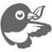
 | 

 |
| 
&nbsp;&nbsp;&nbsp;&nbsp;&nbsp;&nbsp;&nbsp;&nbsp;<a href="https://babeljs.io/">seti:babel</a> ℹ <a href="https://github.com/jesseweed/seti-ui/blob/master/icons/babel.svg">🔗</a>
 | 
&nbsp;&nbsp;&nbsp;&nbsp;&nbsp;&nbsp;&nbsp;&nbsp;<a href="https://bazel.build/">seti:bazel</a> ℹ <a href="https://github.com/jesseweed/seti-ui/blob/master/icons/bazel.svg">🔗</a>
 | 
&nbsp;&nbsp;&nbsp;&nbsp;&nbsp;&nbsp;&nbsp;&nbsp;<a href="https://bower.io/">seti:bower</a> ℹ <a href="https://github.com/jesseweed/seti-ui/blob/master/icons/bower.svg">🔗</a>
 | 
&nbsp;&nbsp;&nbsp;&nbsp;&nbsp;&nbsp;&nbsp;&nbsp;<a href="https://elixirscript.github.io/">seti:elixir_script</a> ℹ <a href="https://github.com/jesseweed/seti-ui/blob/master/icons/elixir_script.svg">🔗</a>
 |
| 

 | 

 | 

 | 

 |
| 
&nbsp;&nbsp;&nbsp;&nbsp;&nbsp;&nbsp;&nbsp;&nbsp;<a href="https://gradle.org/">seti:gradle</a> ℹ <a href="https://github.com/jesseweed/seti-ui/blob/master/icons/gradle.svg">🔗</a>
 | 
&nbsp;&nbsp;&nbsp;&nbsp;&nbsp;&nbsp;&nbsp;&nbsp;<a href="https://gruntjs.com/">seti:grunt</a> ℹ <a href="https://github.com/jesseweed/seti-ui/blob/master/icons/grunt.svg">🔗</a>
 | 
&nbsp;&nbsp;&nbsp;&nbsp;&nbsp;&nbsp;&nbsp;&nbsp;<a href="https://gulpjs.com/">seti:gulp</a> ℹ <a href="https://github.com/jesseweed/seti-ui/blob/master/icons/gulp.svg">🔗</a>
 | 
&nbsp;&nbsp;&nbsp;&nbsp;&nbsp;&nbsp;&nbsp;&nbsp;<a href="https://hex.pm/">seti:hex</a> ℹ <a href="https://github.com/jesseweed/seti-ui/blob/master/icons/hex.svg">🔗</a>
 |
| 

 | 

 | 

 | 

 |
| 
&nbsp;&nbsp;&nbsp;&nbsp;<a href="https://brew.sh/">homebrew</a> ℹ
 | 
&nbsp;&nbsp;&nbsp;&nbsp;<a href="https://jsr.io/">jsr</a> ℹ
 | 
&nbsp;&nbsp;&nbsp;&nbsp;&nbsp;&nbsp;&nbsp;&nbsp;<a href="https://www.gnu.org/software/make/manual/make.html">seti:makefile</a> ℹ <a href="https://github.com/jesseweed/seti-ui/blob/master/icons/makefile.svg">🔗</a>
 | 
&nbsp;&nbsp;&nbsp;&nbsp;&nbsp;&nbsp;&nbsp;&nbsp;<a href="https://maven.apache.org/">seti:maven</a> ℹ <a href="https://github.com/jesseweed/seti-ui/blob/master/icons/maven.svg">🔗</a>
 |
| 

 | 

 | 

 | 
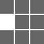
 |
| 
&nbsp;&nbsp;&nbsp;&nbsp;<a href="https://nixos.org/nix/">nix</a> ℹ
 | 
&nbsp;&nbsp;&nbsp;&nbsp;<a href="https://www.npmjs.com/">npm</a> ℹ
 | 
&nbsp;&nbsp;&nbsp;&nbsp;&nbsp;&nbsp;&nbsp;&nbsp;<a href="https://www.npmjs.com/">seti:npm</a> ℹ <a href="https://github.com/jesseweed/seti-ui/blob/master/icons/npm.svg">🔗</a>
 | 
&nbsp;&nbsp;&nbsp;&nbsp;<a href="https://pnpm.io/">pnpm</a> ℹ
 |
| 

 | 

 | 
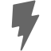
 | 

 |
| 
&nbsp;&nbsp;&nbsp;&nbsp;&nbsp;&nbsp;&nbsp;&nbsp;<a href="https://rollupjs.org/">seti:rollup</a> ℹ <a href="https://github.com/jesseweed/seti-ui/blob/master/icons/rollup.svg">🔗</a>
 | 
&nbsp;&nbsp;&nbsp;&nbsp;&nbsp;&nbsp;&nbsp;&nbsp;<a href="https://www.scala-sbt.org/">seti:sbt</a> ℹ <a href="https://github.com/jesseweed/seti-ui/blob/master/icons/sbt.svg">🔗</a>
 | 
&nbsp;&nbsp;&nbsp;&nbsp;&nbsp;&nbsp;&nbsp;&nbsp;<a href="https://vitejs.dev/">seti:vite</a> ℹ <a href="https://github.com/jesseweed/seti-ui/blob/master/icons/vite.svg">🔗</a>
 | 
&nbsp;&nbsp;&nbsp;&nbsp;&nbsp;&nbsp;&nbsp;&nbsp;<a href="https://webpack.js.org/">seti:webpack</a> ℹ <a href="https://github.com/jesseweed/seti-ui/blob/master/icons/webpack.svg">🔗</a>
 |
| 

 |   |   |   |
| 
&nbsp;&nbsp;&nbsp;&nbsp;&nbsp;&nbsp;&nbsp;&nbsp;<a href="https://yarnpkg.com/">seti:yarn</a> ℹ <a href="https://github.com/jesseweed/seti-ui/blob/master/icons/yarn.svg">🔗</a>
 |   |   |   |

### Development Services

| |  |  | |
|:---:|:------:|:------:|:---:|
| 

 | 

 | 

 | 

 |
| 
&nbsp;&nbsp;&nbsp;&nbsp;<a href="https://azure.microsoft.com/en-us/services/devops/">azureDevOps</a> ℹ
 | 
&nbsp;&nbsp;&nbsp;&nbsp;&nbsp;&nbsp;&nbsp;&nbsp;<a href="https://learn.microsoft.com/en-us/azure/azure-resource-manager/bicep/overview?tabs=bicep">seti:bicep</a> ℹ <a href="https://github.com/jesseweed/seti-ui/blob/master/icons/bicep.svg">🔗</a>
 | 
&nbsp;&nbsp;&nbsp;&nbsp;<a href="https://bitbucket.org/">bitbucket</a> ℹ
 | 
&nbsp;&nbsp;&nbsp;&nbsp;<a href="https://www.cloudflare.com/">cloudflare</a> ℹ
 |
| 

 | 

 | 

 | 

 |
| 
&nbsp;&nbsp;&nbsp;&nbsp;&nbsp;&nbsp;&nbsp;&nbsp;<a href="https://1c-dn.com/1c_enterprise/">seti:bsl</a> ℹ <a href="https://github.com/jesseweed/seti-ui/blob/master/icons/bsl.svg">🔗</a>
 | 
&nbsp;&nbsp;&nbsp;&nbsp;&nbsp;&nbsp;&nbsp;&nbsp;<a href="https://1c-dn.com/1c_enterprise/">seti:mdo</a> ℹ <a href="https://github.com/jesseweed/seti-ui/blob/master/icons/mdo.svg">🔗</a>
 | 
&nbsp;&nbsp;&nbsp;&nbsp;&nbsp;&nbsp;&nbsp;&nbsp;<a href="https://codeclimate.com/">seti:code-climate</a> ℹ <a href="https://github.com/jesseweed/seti-ui/blob/master/icons/code-climate.svg">🔗</a>
 | 
&nbsp;&nbsp;&nbsp;&nbsp;<a href="https://codeberg.org/">codeberg</a> ℹ
 |
| 

 | 
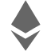
 | 

 | 

 |
| 
&nbsp;&nbsp;&nbsp;&nbsp;<a href="https://codepen.io/">codePen</a> ℹ
 | 
&nbsp;&nbsp;&nbsp;&nbsp;&nbsp;&nbsp;&nbsp;&nbsp;<a href="https://ethereum.org/">seti:ethereum</a> ℹ <a href="https://github.com/jesseweed/seti-ui/blob/master/icons/ethereum.svg">🔗</a>
 | 
&nbsp;&nbsp;&nbsp;&nbsp;&nbsp;&nbsp;&nbsp;&nbsp;<a href="https://firebase.google.com/">seti:firebase</a> ℹ <a href="https://github.com/jesseweed/seti-ui/blob/master/icons/firebase.svg">🔗</a>
 | 
&nbsp;&nbsp;&nbsp;&nbsp;<a href="https://stackoverflow.com/">stackOverflow</a> ℹ
 |
| 

 | 

 | 

 | 

 |
| 
&nbsp;&nbsp;&nbsp;&nbsp;<a href="https://www.hackerone.com/">hackerOne</a> ℹ
 | 
&nbsp;&nbsp;&nbsp;&nbsp;<a href="https://github.com/">github</a> ℹ
 | 
&nbsp;&nbsp;&nbsp;&nbsp;&nbsp;&nbsp;&nbsp;&nbsp;<a href="https://github.com/">seti:github</a> ℹ <a href="https://github.com/jesseweed/seti-ui/blob/master/icons/github.svg">🔗</a>
 | 
&nbsp;&nbsp;&nbsp;&nbsp;<a href="https://gitlab.com/">gitlab</a> ℹ
 |
| 

 | 

 | 
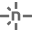
 | 

 |
| 
&nbsp;&nbsp;&nbsp;&nbsp;&nbsp;&nbsp;&nbsp;&nbsp;<a href="https://gitlab.com/">seti:gitlab</a> ℹ <a href="https://github.com/jesseweed/seti-ui/blob/master/icons/gitlab.svg">🔗</a>
 | 
&nbsp;&nbsp;&nbsp;&nbsp;&nbsp;&nbsp;&nbsp;&nbsp;<a href="https://www.heroku.com/">seti:heroku</a> ℹ <a href="https://github.com/jesseweed/seti-ui/blob/master/icons/heroku.svg">🔗</a>
 | 
&nbsp;&nbsp;&nbsp;&nbsp;<a href="https://www.netlify.com/">netlify</a> ℹ
 | 
&nbsp;&nbsp;&nbsp;&nbsp;&nbsp;&nbsp;&nbsp;&nbsp;<a href="https://www.prisma.io/">seti:prisma</a> ℹ <a href="https://github.com/jesseweed/seti-ui/blob/master/icons/prisma.svg">🔗</a>
 |
| 

 | 

 | 

 |   |
| 
&nbsp;&nbsp;&nbsp;&nbsp;&nbsp;&nbsp;&nbsp;&nbsp;<a href="https://www.salesforce.com/">seti:salesforce</a> ℹ <a href="https://github.com/jesseweed/seti-ui/blob/master/icons/salesforce.svg">🔗</a>
 | 
&nbsp;&nbsp;&nbsp;&nbsp;<a href="https://sourcehut.org/">sourcehut</a> ℹ
 | 
&nbsp;&nbsp;&nbsp;&nbsp;<a href="https://vercel.com/">vercel</a> ℹ
 |   |

### Development Tools

| |  |  | |
|:---:|:------:|:------:|:---:|
| 

 | 
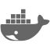
 | 

 | 

 |
| 
&nbsp;&nbsp;&nbsp;&nbsp;<a href="https://duckduckgo.com/?q=https%3A%2F%2Fwww.atlassian.com%2Fsoftware%2Fconfluence">confluence</a> ℹ
 | 
&nbsp;&nbsp;&nbsp;&nbsp;&nbsp;&nbsp;&nbsp;&nbsp;<a href="https://www.docker.com/">seti:docker</a> ℹ <a href="https://github.com/jesseweed/seti-ui/blob/master/icons/docker.svg">🔗</a>
 | 
&nbsp;&nbsp;&nbsp;&nbsp;&nbsp;&nbsp;&nbsp;&nbsp;<a href="https://eslint.org/">seti:eslint</a> ℹ <a href="https://github.com/jesseweed/seti-ui/blob/master/icons/eslint.svg">🔗</a>
 | 
&nbsp;&nbsp;&nbsp;&nbsp;&nbsp;&nbsp;&nbsp;&nbsp;<a href="https://git-scm.com/">seti:git</a> ℹ <a href="https://github.com/jesseweed/seti-ui/blob/master/icons/git.svg">🔗</a>
 |
| 

 | 

 | 

 | 

 |
| 
&nbsp;&nbsp;&nbsp;&nbsp;&nbsp;&nbsp;&nbsp;&nbsp;<a href="https://www.jenkins.io/">seti:jenkins</a> ℹ <a href="https://github.com/jesseweed/seti-ui/blob/master/icons/jenkins.svg">🔗</a>
 | 
&nbsp;&nbsp;&nbsp;&nbsp;<a href="https://www.jetbrains.com/">jetbrains</a> ℹ
 | 
&nbsp;&nbsp;&nbsp;&nbsp;<a href="https://duckduckgo.com/?q=https%3A%2F%2Fwww.atlassian.com%2Fsoftware%2Fjira">jira</a> ℹ
 | 
&nbsp;&nbsp;&nbsp;&nbsp;&nbsp;&nbsp;&nbsp;&nbsp;<a href="https://karma-runner.github.io/">seti:karma</a> ℹ <a href="https://github.com/jesseweed/seti-ui/blob/master/icons/karma.svg">🔗</a>
 |
| 

 | 

 | 

 | 

 |
| 
&nbsp;&nbsp;&nbsp;&nbsp;&nbsp;&nbsp;&nbsp;&nbsp;<a href="https://puppet.com/">seti:puppet</a> ℹ <a href="https://github.com/jesseweed/seti-ui/blob/master/icons/puppet.svg">🔗</a>
 | 
&nbsp;&nbsp;&nbsp;&nbsp;<a href="https://storybook.js.org/">storybook</a> ℹ
 | 
&nbsp;&nbsp;&nbsp;&nbsp;&nbsp;&nbsp;&nbsp;&nbsp;<a href="https://stylelint.io/">seti:stylelint</a> ℹ <a href="https://github.com/jesseweed/seti-ui/blob/master/icons/stylelint.svg">🔗</a>
 | 
&nbsp;&nbsp;&nbsp;&nbsp;&nbsp;&nbsp;&nbsp;&nbsp;<a href="https://www.sublimetext.com/">seti:sublime</a> ℹ <a href="https://github.com/jesseweed/seti-ui/blob/master/icons/sublime.svg">🔗</a>
 |
| 

 | 

 | 

 | 

 |
| 
&nbsp;&nbsp;&nbsp;&nbsp;&nbsp;&nbsp;&nbsp;&nbsp;<a href="https://www.terraform.io/">seti:terraform</a> ℹ <a href="https://github.com/jesseweed/seti-ui/blob/master/icons/terraform.svg">🔗</a>
 | 
&nbsp;&nbsp;&nbsp;&nbsp;<a href="https://www.vim.org/">vim</a> ℹ
 | 
&nbsp;&nbsp;&nbsp;&nbsp;<a href="https://code.visualstudio.com/">vscode</a> ℹ
 | 
&nbsp;&nbsp;&nbsp;&nbsp;<a href="https://zed.dev/">zed</a> ℹ
 |

### Word Processing, Design & Media

| |  |  | |
|:---:|:------:|:------:|:---:|
| 

 | 

 | 

 | 

 |
| 
&nbsp;&nbsp;&nbsp;&nbsp;<a href="https://www.figma.com/">figma</a> ℹ
 | 
&nbsp;&nbsp;&nbsp;&nbsp;&nbsp;&nbsp;&nbsp;&nbsp;<a href="https://www.mozilla.org/firefox/">seti:firefox</a> ℹ <a href="https://github.com/jesseweed/seti-ui/blob/master/icons/firefox.svg">🔗</a>
 | 
&nbsp;&nbsp;&nbsp;&nbsp;&nbsp;&nbsp;&nbsp;&nbsp;<a href="https://godotengine.org/">seti:godot</a> ℹ <a href="https://github.com/jesseweed/seti-ui/blob/master/icons/godot.svg">🔗</a>
 | 
&nbsp;&nbsp;&nbsp;&nbsp;&nbsp;&nbsp;&nbsp;&nbsp;<a href="https://www.adobe.com/products/illustrator.html">seti:illustrator</a> ℹ <a href="https://github.com/jesseweed/seti-ui/blob/master/icons/illustrator.svg">🔗</a>
 |
| 

 | 

 | 

 |   |
| 
&nbsp;&nbsp;&nbsp;&nbsp;&nbsp;&nbsp;&nbsp;&nbsp;<a href="https://www.adobe.com/products/photoshop.html">seti:photoshop</a> ℹ <a href="https://github.com/jesseweed/seti-ui/blob/master/icons/photoshop.svg">🔗</a>
 | 
&nbsp;&nbsp;&nbsp;&nbsp;<a href="https://www.sketch.com/">sketch</a> ℹ
 | 
&nbsp;&nbsp;&nbsp;&nbsp;&nbsp;&nbsp;&nbsp;&nbsp;<a href="https://www.microsoft.com/en-us/microsoft-365/word">seti:word</a> ℹ <a href="https://github.com/jesseweed/seti-ui/blob/master/icons/word.svg">🔗</a>
 |   |

### File types, Files & Protocols

| |  |  | |
|:---:|:------:|:------:|:---:|
| 

 | 

 | 

 | 

 |
| 
&nbsp;&nbsp;&nbsp;&nbsp;&nbsp;&nbsp;&nbsp;&nbsp;<a href="https://tools.ietf.org/html/rfc4180">seti:csv</a> ℹ <a href="https://github.com/jesseweed/seti-ui/blob/master/icons/csv.svg">🔗</a>
 | 
&nbsp;&nbsp;&nbsp;&nbsp;&nbsp;&nbsp;&nbsp;&nbsp;<a href="https://fonts.google.com/">seti:font</a> ℹ <a href="https://github.com/jesseweed/seti-ui/blob/master/icons/font.svg">🔗</a>
 | 
&nbsp;&nbsp;&nbsp;&nbsp;&nbsp;&nbsp;&nbsp;&nbsp;<a href="https://www.adobe.com/acrobat/pdf-reader.html">seti:pdf</a> ℹ <a href="https://github.com/jesseweed/seti-ui/blob/master/icons/pdf.svg">🔗</a>
 | 
&nbsp;&nbsp;&nbsp;&nbsp;&nbsp;&nbsp;&nbsp;&nbsp;rss ℹ <a href="https://www.rssboard.org/">🔗</a>
 |
| 

 | 

 | 

 | 

 |
| 
&nbsp;&nbsp;&nbsp;&nbsp;&nbsp;&nbsp;&nbsp;&nbsp;<a href="https://www.w3.org/Graphics/SVG/">seti:svg</a> ℹ <a href="https://github.com/jesseweed/seti-ui/blob/master/icons/svg.svg">🔗</a>
 | 
&nbsp;&nbsp;&nbsp;&nbsp;&nbsp;&nbsp;&nbsp;&nbsp;<a href="https://www.latex-project.org/">seti:tex</a> ℹ <a href="https://github.com/jesseweed/seti-ui/blob/master/icons/tex.svg">🔗</a>
 | 
&nbsp;&nbsp;&nbsp;&nbsp;&nbsp;&nbsp;&nbsp;&nbsp;<a href="https://www.typescriptlang.org/tsconfig">seti:tsconfig</a> ℹ <a href="https://github.com/jesseweed/seti-ui/blob/master/icons/tsconfig.svg">🔗</a>
 | 
&nbsp;&nbsp;&nbsp;&nbsp;&nbsp;&nbsp;&nbsp;&nbsp;<a href="https://www.w3.org/TR/widgets/">seti:wgt</a> ℹ <a href="https://github.com/jesseweed/seti-ui/blob/master/icons/wgt.svg">🔗</a>
 |
| 
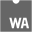
 | 

 | 

 | 

 |
| 
&nbsp;&nbsp;&nbsp;&nbsp;&nbsp;&nbsp;&nbsp;&nbsp;<a href="https://webassembly.org/">seti:wasm</a> ℹ <a href="https://github.com/jesseweed/seti-ui/blob/master/icons/wasm.svg">🔗</a>
 | 
&nbsp;&nbsp;&nbsp;&nbsp;&nbsp;&nbsp;&nbsp;&nbsp;<a href="https://webassembly.github.io/spec/core/text/index.html">seti:wat</a> ℹ <a href="https://github.com/jesseweed/seti-ui/blob/master/icons/wat.svg">🔗</a>
 | 
&nbsp;&nbsp;&nbsp;&nbsp;&nbsp;&nbsp;&nbsp;&nbsp;<a href="https://www.microsoft.com/en-us/microsoft-365/excel">seti:xls</a> ℹ <a href="https://github.com/jesseweed/seti-ui/blob/master/icons/xls.svg">🔗</a>
 | 
&nbsp;&nbsp;&nbsp;&nbsp;&nbsp;&nbsp;&nbsp;&nbsp;<a href="https://www.pkware.com/software/zip">seti:zip</a> ℹ <a href="https://github.com/jesseweed/seti-ui/blob/master/icons/zip.svg">🔗</a>
 |

### Content Creators

| |  |  | |
|:---:|:------:|:------:|:---:|
| 

 | 

 | 

 | 

 |
| 
&nbsp;&nbsp;&nbsp;&nbsp;<a href="https://www.instagram.com/">instagram</a> ℹ
 | 
&nbsp;&nbsp;&nbsp;&nbsp;<a href="https://opencollective.com/">openCollective</a> ℹ
 | 
&nbsp;&nbsp;&nbsp;&nbsp;<a href="https://www.patreon.com/">patreon</a> ℹ
 | 
&nbsp;&nbsp;&nbsp;&nbsp;<a href="https://www.pinterest.com/">pinterest</a> ℹ
 |
| 

 | 

 | 

 | 

 |
| 
&nbsp;&nbsp;&nbsp;&nbsp;<a href="https://www.reddit.com/">reddit</a> ℹ
 | 
&nbsp;&nbsp;&nbsp;&nbsp;<a href="https://substack.com/">substack</a> ℹ
 | 
&nbsp;&nbsp;&nbsp;&nbsp;<a href="https://www.tiktok.com/">tiktok</a> ℹ
 | 
&nbsp;&nbsp;&nbsp;&nbsp;<a href="https://www.twitch.tv/">twitch</a> ℹ
 |
| 

 |   |   |   |
| 
&nbsp;&nbsp;&nbsp;&nbsp;<a href="https://www.youtube.com/">youtube</a> ℹ
 |   |   |   |

### Social Networks

| |  |  | |
|:---:|:------:|:------:|:---:|
| 

 | 

 | 

 | 

 |
| 
&nbsp;&nbsp;&nbsp;&nbsp;<a href="https://blueskyweb.xyz/">blueSky</a> ℹ
 | 
&nbsp;&nbsp;&nbsp;&nbsp;<a href="https://www.facebook.com/">facebook</a> ℹ
 | 
&nbsp;&nbsp;&nbsp;&nbsp;<a href="https://www.farcaster.xyz/">farcaster</a> ℹ
 | 
&nbsp;&nbsp;&nbsp;&nbsp;<a href="https://www.linkedin.com/">linkedin</a> ℹ
 |
| 

 | 

 | 

 | 

 |
| 
&nbsp;&nbsp;&nbsp;&nbsp;<a href="https://joinmastodon.org/">mastodon</a> ℹ
 | 
&nbsp;&nbsp;&nbsp;&nbsp;<a href="https://nostr.com/">nostr</a> ℹ
 | 
&nbsp;&nbsp;&nbsp;&nbsp;<a href="https://twitter.com/">twitter</a> ℹ
 | 
&nbsp;&nbsp;&nbsp;&nbsp;<a href="https://x.com/">x.com</a> ℹ
 |
| 

 |   |   |   |
| 
&nbsp;&nbsp;&nbsp;&nbsp;<a href="https://www.threads.com/">threads</a> ℹ
 |   |   |   |

### Communication

| |  |  | |
|:---:|:------:|:------:|:---:|
| 

 | 

 | 

 | 

 |
| 
&nbsp;&nbsp;&nbsp;&nbsp;<a href="https://discord.com/">discord</a> ℹ
 | 
&nbsp;&nbsp;&nbsp;&nbsp;<a href="https://www.discourse.org/">discourse</a> ℹ
 | 
&nbsp;&nbsp;&nbsp;&nbsp;<a href="https://gitter.im/">gitter</a> ℹ
 | 
&nbsp;&nbsp;&nbsp;&nbsp;<a href="https://matrix.org/">matrix</a> ℹ
 |
| 

 | 
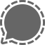
 | 

 | 

 |
| 
&nbsp;&nbsp;&nbsp;&nbsp;<a href="https://www.microsoft.com/en-us/microsoft-teams/group-chat-software">microsoftTeams</a> ℹ
 | 
&nbsp;&nbsp;&nbsp;&nbsp;<a href="https://signal.org/">signal</a> ℹ
 | 
&nbsp;&nbsp;&nbsp;&nbsp;<a href="https://slack.com/">slack</a> ℹ
 | 
&nbsp;&nbsp;&nbsp;&nbsp;<a href="https://telegram.org/">telegram</a> ℹ
 |
| 

 |   |   |   |
| 
&nbsp;&nbsp;&nbsp;&nbsp;<a href="https://zulip.com/">zulip</a> ℹ
 |   |   |   |

### OS & Platforms

| |  |  | |
|:---:|:------:|:------:|:---:|
| 

 | 

 | 

 |   |
| 
&nbsp;&nbsp;&nbsp;&nbsp;<a href="https://www.apple.com/">apple</a> ℹ
 | 
&nbsp;&nbsp;&nbsp;&nbsp;<a href="https://en.wikipedia.org/wiki/Linux">linux</a> ℹ
 | 
&nbsp;&nbsp;&nbsp;&nbsp;&nbsp;&nbsp;&nbsp;&nbsp;<a href="https://www.microsoft.com/windows">seti:windows</a> ℹ <a href="https://github.com/jesseweed/seti-ui/blob/master/icons/windows.svg">🔗</a>
 |   |

## How to use built-in Icons

Quickly find where to use built-in Starlight icons:
- 🖼️ [Icons Reference](https://starlight.astro.build/reference/icons)  
- 🛠️ [Icon Component](https://starlight.astro.build/components/icons/)  
- 📋 [Aside Component](https://starlight.astro.build/components/asides/)  
- 📝 [Aside in Markdown](https://starlight.astro.build/guides/authoring-content/#asides)  
- 🎴 [Cards Component](https://starlight.astro.build/components/cards/)  
- 🌟 [Hero Component](https://starlight.astro.build/reference/frontmatter/#hero)  

## Using Custom Icons

### 🚀  Astro Icons integration

The [Astro Icons](https://www.astroicon.dev/) integration lets you:

- 🏠 Use local custom icons  
- 🌐 Any icon from [Iconify Icon Sets](https://icon-sets.iconify.design/) or [Icônes](https://icones.js.org/)  

> [!NOTE]  
> These icons **won’t automatically work** with built-in Starlight components. Use them in your own components or the alternative [Icon component](https://www.astroicon.dev/guides/components).  

> [!TIP]
> You *can* override Starlight components to replace built-in icons with your custom icons using [component overrides](https://starlight.astro.build/guides/overriding-components/).

### 📦 Starlight Markdown Blocks integration

The [Starlight Markdown Blocks](https://delucis.github.io/starlight-markdown-blocks/) integration overrides the starlight Aside component and changes it to allow:

- 🏠 Use local custom icons  
- 🛠️ Use any Icon component including alternatives
- ✏️ Use **text strings**, including **UTF-8 Emoji** 

## 😎 Using UTF-8 Emoji as Icons

- ✅ Emoji can stand in for icons in markdown or *Starlight Markdown Blocks* Asides
- ⚠️ Appearance may differ across platforms; use SVGs for a **consistent look**  

See our ✂️ [UTF-8 Emoji Icons by Category](../../../../docs/text/utf8-emoji-icons-by-category/README.md) for inspiration.

---

🎉 With these options, your site will be visually polished in no time!

> [!TIP]
> This snippet includes auto-generated content.  
> See [CONTRIBUTING.md](./CONTRIBUTING.md) for details on updating or regenerating the icons list.

**📚 References and Credits**

- [Starlight Icon Reference](https://starlight.astro.build/reference/icons/)
- [starlight · Icons.ts](https://github.com/withastro/starlight/blob/main/packages/starlight/components/Icons.ts)
- [starlight · file-tree-icons.ts](https://github.com/withastro/starlight/blob/main/packages/starlight/user-components/file-tree-icons.ts)
- [Seti UI](https://github.com/jesseweed/seti-ui/)
- [Seti Icon Set](https://github.com/elviswolcott/seti-icons) — *No license stated*

*(Sources are MIT licensed unless otherwise noted.
Unlicensed sources are referenced for context only and are not redistributed here.)*

✨ *ChatGPT was used to help draft language, formatting, and code — plus we just love em dashes.*

  😐 <a href="https://github.com/apathetic-tools">Apathetic Tools</a> © 
  Guide <a href="../../../../LICENSE-CONTENT">CC&nbsp;BY-NC</a> · 
  Code <a href="../../../../LICENSE">MIT</a>

