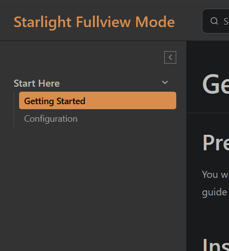
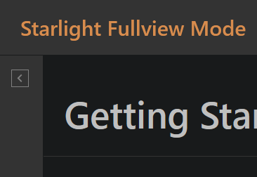
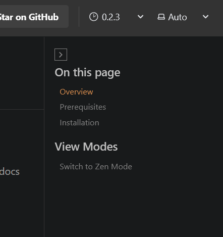
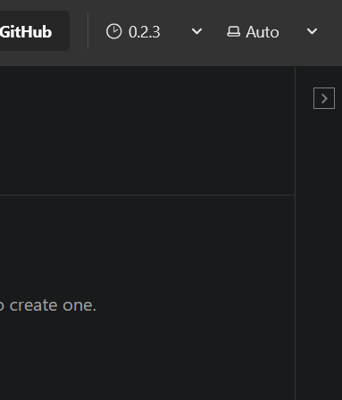
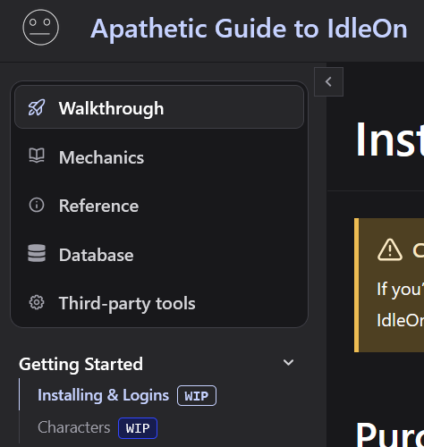
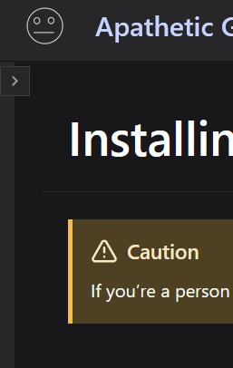
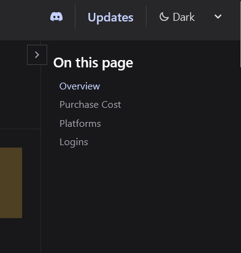
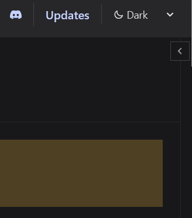

# Sidebar Toggles

Give readers the power to **collapse the sidebars** on Astro Starlight sites — perfect for enlarging the main content area and focusing on what matters.

This [snippet](https://github.com/apathetic-tools/snippets) was created by 😐 [Apathetic Tools](https://github.com/apathetic-tools), with thanks to [Windmillcode](https://github.com/WindMillCode) for the original idea.  
<sub>Guide licensed [CC BY-NC](../../../LICENSE-CONTENT) · Code snippets [MIT](../../../LICENSE)</sub>

## Alternatives: Plugins

Before coding your own using this snippet, check out [Starlight Fullview Mode](https://windmillcode.github.io/starlight-fullview-mode/) by WindMillCode. It’s ready-made and covers much of the same functionality.


| Feature | Plugin (Fullview Mode) | Our Snippet (Roll Your Own) |
|---------|-------------------------|--------------------------|
| **Left Sidebar** | ✅ Built-in | ✏️ Custom supported |
| **Right Sidebar / TOC** | ✅ Built-in  | ✏️ Custom supported |
| **Remembers State** | ✅ LocalStorage | ✅ LocalStorage |
| **Configuration** | ✅ Plugin Config | ⚠️ *Embedded in CSS and Component* |
| **Maintenance** | ✅ No code / CSS | ⚠️ Minimal footprint |
| **Plugin Compatibility** | ⚠️ May conflict (e.g. [starlight-sidebar-topics](https://starlight-sidebar-topics.netlify.app/)) | ✏️ Manual integration required |
| **Dependencies** | ✅ Self-contained, minimal | 🔎 Requires `astro-icon` + icons |
| **Icons** | ⚠️ Single icon for everything | ✅ Custom icons (expand/collapse) |
| **CustomCSS support** | ✏️ Starlight | ✏️ Starlight |
| **Button placement** | ⚠️ Top only | ✏️ Fully customizable |
| **Sidebar flicker on load** | ⚠️ Collapsed flickers briefly ([status](https://github.com/WindMillCode/starlight-fullview-mode/issues/2)) | ✅ No flicker — state applied before paint |
| **Animations** | ❌ Not supported | ❌ Not supported |

> [!NOTE]  
> Neither option currently supports 🎦animations. If you figure out a smooth solution, please share! 🎉  

## Screenshots

### Plugin (Fullview Mode)

| Expanded | Collapsed |
|:---------|:----------|
| **Left Sidebar**<br> |  |
| **Right Sidebar / TOC**<br> |  |

### Our Snippet (Roll Your Own / Default Example)

| Expanded | Collapsed |
|:---------|:----------|
| **Left Sidebar**<br> |  |
| **Right Sidebar / TOC**<br> |  |

---

## If you’ve decided to roll your own, let’s dive in! 🚀

## Dependencies

We’ll use [astro-icon](https://www.astroicon.dev/) for flexible SVG icons. Install it with [Material Design Icons (MDI)](https://icon-sets.iconify.design/mdi/?keyword=mdi) as the default:

```bash
pnpm add astro-icon @iconify-json/mdi
```

> [!NOTE]
>  `astro-icon` is zero configuration with good defaults. No need to also add it to your configs.

## Toggle Component

`src/components/sidebar-toggles/SidebarToggle.astro`
```jsx
---
// Inspired by Apathetic Tools · MIT
// https://github.com/apathetic-tools/snippets/blob/main/docs/astro-starlight/sidebar-toggles
// Inspired by Windmillcode/starlight-fullview-mode · MIT
// https://github.com/Windmillcode/starlight-fullview-mode

import { Icon } from "astro-icon/components";

export interface Props {
  side?: "left" | "right";
  collapseIcon?: string;
  expandIcon?: string;
}

const { side = "left", collapseIcon, expandIcon } = Astro.props;

const icons = {
  collapse: collapseIcon ?? (side === "left" ? "mdi:chevron-left" : "mdi:chevron-right"),
  expand: expandIcon ?? (side === "left" ? "mdi:chevron-right" : "mdi:chevron-left")
};
---

<div 
  class={`toggle-${side}-sidebar-btn toggle-sidebar-btn`} 
  role="button"
  tabindex="0"
  aria-expanded="true"
>
  <Icon name={icons.collapse} class="icon-collapse" title="Collapse" />
  <Icon name={icons.expand} class="icon-expand" title="Expand" />
</div>

<style>
[data-icon] {
  height: 1.125rem;
  width: 1.125rem;
}

/* default non-collapsed rule */
.icon-collapse { display: inline-flex; }
.icon-expand { display: none; }

/* icon visibility by state */
:global(.left-sidebar-collapsed) .icon-expand,
:global(.right-sidebar-collapsed) .icon-expand { display: inline-flex; }
:global(.left-sidebar-collapsed) .icon-collapse,
:global(.right-sidebar-collapsed) .icon-collapse { display: none; }
</style>

<script is:inline define:vars={{ side }}>
    (function () {
        /** @type {HTMLElement | null} */
        const btn = document.querySelector(`.toggle-${side}-sidebar-btn`);
        if (!btn) return;

        const collapsedClassname = `${side}-sidebar-collapsed`;
        const storageKey = `starlight-${side}-sidebar-collapsed`;

        /**
         * @param {boolean} collapsed
         */
        function applyState(collapsed) {
            btn.setAttribute("aria-expanded", collapsed ? "false" : "true");
        }

        const initialCollapsed = sessionStorage.getItem(storageKey) === "1";
        applyState(initialCollapsed);

        btn.addEventListener("click", () => {
            const now = document.documentElement.classList.toggle(collapsedClassname);
            applyState(now);
            sessionStorage.setItem(storageKey, now ? "1" : "0");
        });

        btn.addEventListener("keydown", /** @param {KeyboardEvent} e */ (e) => {
            if (e.key === "Enter" || e.key === " ") {
                e.preventDefault();
                btn.click();
            }
        });
    })();
</script>
```

✅ Accessible: aria-expanded updates, tabbed Enter/Space toggle works.

## Global Script (prevent sflicker)
`src/components/sidebar-toggles/utils/sidebarStateScript.js`
```js
// Inspired by Apathetic Tools · MIT
// https://github.com/apathetic-tools/snippets/blob/main/docs/astro-starlight/sidebar-toggles

/* global document:readonly, sessionStorage:readonly, console:readonly */
(function () {
    try {
		const savedLeftSidebar = sessionStorage.getItem("starlight-left-sidebar-collapsed") === "1";
		if (savedLeftSidebar) {
				document.documentElement.classList.add('left-sidebar-collapsed');
		}
		const savedrightSidebar = sessionStorage.getItem("starlight-right-sidebar-collapsed") === "1";
		if (savedrightSidebar) {
				document.documentElement.classList.add('right-sidebar-collapsed');
		}
    } catch (e) {
        // Fail silently if sessionStorage is not available (e.g., privacy mode)
        console.warn("Sidebar state could not be read from sessionStorage:", e);
    }
})();
```

### Loader Helper

`src/components/sidebar-toggles/utils/index.ts`
```ts
// Inspired by Apathetic Tools · MIT
// https://github.com/apathetic-tools/snippets/blob/main/docs/astro-starlight/sidebar-toggles

import fs from 'fs';
import path from 'path';
import { fileURLToPath } from 'url';

export function readSidebarStateScript(): string {
	// Compute the directory of this module
	const __filename = fileURLToPath(import.meta.url);
	const __dirname = path.dirname(__filename);

	// Absolute path to your script file
	const filePath = path.resolve(__dirname, 'sidebarStateScript.js');
	return fs.readFileSync(filePath, 'utf-8');
}
```

## Component Overrides

Tell Starlight to use your toggle before its defaults.

### Sidebar Override
`src/overrides/starlight/Sidebar.astro`
```jsx
---
import Default from '@astrojs/starlight/components/Sidebar.astro'
import SidebarToggle from '@root/src/components/sidebar-toggles/SidebarToggle.astro'
---
<SidebarToggle side="left" />
<Default><slot /></Default>
```

### TableOfContents Override
`src/overrides/starlight/TableOfContents.astro`
```
// Inspired by Apathetic Tools · MIT
// https://github.com/apathetic-tools/snippets/blob/main/docs/astro-starlight/topics-astro-docs-theme

---
import Default from '@astrojs/starlight/components/TableOfContents.astro'
import SidebarToggle from '@components/sidebar-toggles/SidebarToggle.astro'
---
<SidebarToggle side="right" />
<Default><slot /></Default>
```

> [!TIP]
> If you using other sidebar plugins (e.g. [starlight-sidebar-topics](https://starlight-sidebar-topics.netlify.app/), [starlight-view-modes](https://starlight-view-modes.trueberryless.org/getting-started/)) import their components into your overrides. Check their override components to find out how.

## CSS

`src/styles/sidebar-toggles.css`
```css
/**
 * Inspired by Apathetic Tools · MIT
 * https://github.com/apathetic-tools/snippets/blob/main/docs/astro-starlight/sidebar-toggles
 * Inspired by Windmillcode/starlight-fullview-mode · MIT
 * https://github.com/Windmillcode/starlight-fullview-mode
 */

/**
 * Left sidebar: .sidebar-pane + .sidebar-content + .toggle-left-sidebar-btn
 * Main content: .main-pane + content-panel + sl-container
 * Right sidebar: .right-sidebar-container + .right-sidebar + .right-sidebar-panel + sl-container + .toggle-right-sidebar-btn
 */

@layer our-sidebar-toggles;

/** for both sides */
.main-frame {
  padding-inline-start: var(--sl-content-inline-start);
}

/* when something collapses, we need to grow into the space */
.main-frame .main-pane { flex: 1 1 auto; min-width: auto; }
.main-pane .sl-container { width: 100%; max-width: none; }

/* allow toggle to move outside the sidebars */
.sidebar-content, 
.right-sidebar-container { position: relative; }

/* allow toggle to be visible outside the sidebars */
.sidebar-pane,
.sidebar-content,
.right-sidebar-container, 
.right-sidebar,
.right-sidebar-panel { overflow: visible; }

.toggle-sidebar-btn {
    /* absolute to the sidebar */
    position: absolute;  
    /* top: / left: / right: depending on other class */
    width: 1.65rem;
    height: 1.65rem;
    display: inline-flex;
    justify-content: center;
    align-items: center;
    border: 1px solid var(--sl-color-gray-5);
    z-index: 1000;
    cursor: pointer;
    color: var(--sl-color-gray-3);
    background-color: var(--sl-color-bg-sidebar);
}


/** left sidebar */
.sidebar-pane { flex-shrink: 0; display: flex; flex-direction: column; }
/* absolute to the sidebar */
.toggle-left-sidebar-btn { top: 0.25rem; left: 18rem; }


/** left sidebar collapsed */
.left-sidebar-collapsed {
    & .sidebar-pane { width: 1.1rem; }
    & .sidebar-content > :not(.toggle-left-sidebar-btn) {	display: none !important; }
    & .main-frame .main-pane { flex: 1 1 80%; min-width: 80%; }
    & .main-frame { padding-inline-start: 2.5rem; }
    & .toggle-left-sidebar-btn { left: 0.25rem; }
} 


/** right sidebar (part of main content classes) */
.right-sidebar-container { flex-shrink: 0; display: flex; flex-direction: column; }
/* absolute to the sidebar */
.toggle-right-sidebar-btn { top: 4.3rem;  left: -1.15rem; background-color: var(--sl-color-bg); }


/** right sidebar collapsed */
.right-sidebar-collapsed {
    & .right-sidebar-container { width: 0; min-width: 0; }
    & .right-sidebar .sl-container > :not(.toggle-right-sidebar-btn) { display: none !important; }
    & .main-frame { padding-inline-end: 1.25rem; }
    & .toggle-right-sidebar-btn { left: -0.9rem; }
}


/** hide toggles based on screen size */
@media screen and (max-width: 800px) {
  /* mobile has hamburger menu and TOC menu, no sidebars */
  .toggle-sidebar-btn { display: none; }
}

/* medium screen width you get TOC menu, content moves down, no right sidebar */
@media screen and (max-width: 72rem) {
	.toggle-left-sidebar-btn { top: 3.25rem; }
    .toggle-right-sidebar-btn { display: none; }
}
```

Import in `src/styles/global.css`:
```css
@import './sidebar-toggles.css' layer(our-sidebar-toggles);
```

## Astro Config
`astro.config.ts` *(or `.mjs`, etc.)*
```jsx
import { defineConfig } from 'astro/config';
import starlight from '@astrojs/starlight';
import { readSidebarStateScript } from './src/components/sidebar-toggles/utils';

// https://astro.build/config
export default defineConfig({
    integrations: [starlight({
        head: [{"tag": "script", "content": readSidebarStateScript() }],
        components: {						
            Sidebar: './src/overrides/starlight/Sidebar.astro',
            TableOfContents: './src/overrides/starlight/TableOfContents.astro',
        },
    })],
});
```

## 🎉 Done!

Readers can now expand or collapse sidebars independently, with state remembered across pages.

## 💡 Other Ideas

Want to take it further? Try experimenting with:
- Different Icons
- Alternative toggle positioning  
-  Custom toggle + drawer styles *(you could even hide drawers entirely!)*  

> [!TIP]  
> For a more advanced twist, you could show the **mobile hamburger menu (☰)** when the left sidebar is collapsed, or the **inline TOC selector** (used on small/medium screens) when the right sidebar is collapsed. That’s left as a challenge for you to explore. 😉

And if you crack the puzzle of smooth animations, please share it back with the community! 🎉

## Reference: Page Markup
Here’s a structural map of how Starlight renders sidebars and main content, with **your custom toggle buttons** highlighted.

* `div.page` + `nav.sidebar` — whole screen
    * `div.sidebar-pane` + `div.sidebar-content` — left side under header
        * `div.toggle-sidebar-btn.toggle-left-sidebar-btn` — **your toggle button**
        * `ul.starlight-sidebar-topics` — *(if installed)*
        * `sl-sidebar-state-persist` + `ul.top-level` — regular starlight sidebar groups
    * `div.main-frame` + `div.lg:sl-flex`
        * `aside.right-sidebar-container` + `div.right-sidebar` + `div.right-sidebar-panel` + `div.sl-container`
            * `div.toggle-sidebar-btn.toggle-right-sidebar-btn` — **your toggle button**
            * `starlight-toc` — regular starlight table of contents
        * `div.main-pane` + `main`
            * `div.content-panel` + `.sl-container` + `h1` — page header
            * `div.content-panel` + `.sl-container` + `div.sl-markdown-content` — regular page content

<!-- Spacer to add visual breathing room after code block -->
<br>

---

<br>

**📚 Inspiration and Sources**
- [Windmillcode/starlight-fullview-mode](https://github.com/Windmillcode/starlight-fullview-mode) · MIT

✨ *ChatGPT was used to help draft language, formatting, and code — plus we just love em dashes.*

<p align="center">
  <sub>😐 <a href="https://github.com/apathetic-tools">Apathetic Tools</a> © 
  Guide <a href="../../../LICENSE-CONTENT">CC&nbsp;BY-NC</a> · 
  Code <a href="../../../LICENSE">MIT</a></sub>
</p>