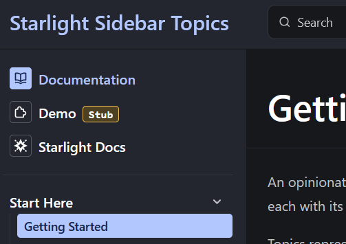
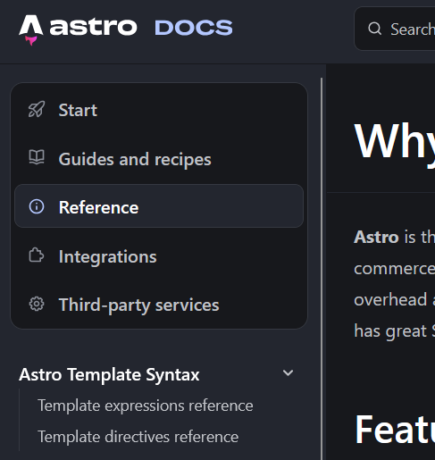
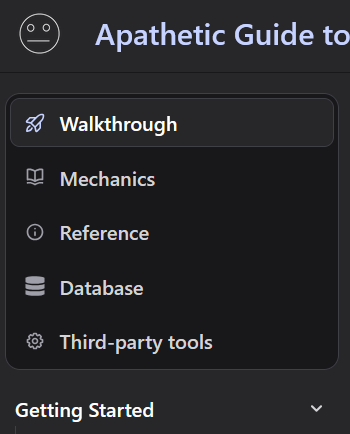

# Theming Starlight Sidebar Topics as Astro Docs

Transform your Starlight sidebar topics to match the polished sidebar style of Astro Docs.

This [snippet](https://github.com/apathetic-tools/snippets) was created by 😐 [Apathetic Tools](https://github.com/apathetic-tools) · [MIT License](../../LICENSE).

## Goal

[Starlight-sidebar-topics](https://starlight-sidebar-topics.netlify.app/) provides switchable sidebar groups (called *topics*) for your [Astro Starlight](https://starlight.astro.build/) documentation site.  

You may prefer the look of the [Official Astro Docs theme](https://docs.astro.build/), which is MIT licensed. It provides a more refined style than the default Starlight sidebar topics.

### From this:



### To this:



The theme features a dark recessed look with rounded corners and highlights the currently selected topic with a pill-style indicator.

## Overview

Both methods replace the CSS provided by the `starlight-sidebar-topics` integration with custom styles to achieve the look of Astro Docs. Since the official Astro docs site implements its own sidebar group switcher, this is not a 1:1 conversion.

Astro allows adding custom CSS files to your site. Starlight also lets you override specific components — even those usually managed by an integration — though doing so comes with extra work and a higher maintenance burden.

The `starlight-sidebar-topics` integration does not currently support, nor plans to support, a dedicated theming mechanism separate from the framework[^1][^2].

### Method A — Custom CSS

**Pros:**
- Single `.css` file → minimal maintenance.
- Upstream components stay untouched → you benefit from future improvements as long as HTML/CSS structure is stable.
- Low risk to site functionality since only styles are overridden.
- Logic remains compatible even if the topics API changes.

**Cons:**
- Requires advanced, brittle CSS selector logic.
- Must carefully reset or override upstream styles.
- CSS may break if upstream HTML/CSS structure changes.

> [!TIP]  
> Ideal for “lightweight theming” where you only want visual updates with minimal code maintenance.

### Method B — Components Overrides

**Pros:**
- Inline styles → stable and insulated from upstream changes.
- Full extensibility → can combine features from multiple integrations.
- Maximum control over behavior and markup (though we will only change styles).

**Cons:**
- Higher maintenance → must maintain the functionality of multiple overridden components.
- Lose automatic updates from upstream components with no easy tracking.
- Components must be updated if the topics API changes.
- Increases code duplication across your repo.

> [!TIP]  
> Best for “full control” scenarios, when you want behavior tweaks along with styling, or need major visual changes without wrestling with CSS selectors. Be aware this adds significant code maintenance.

---

Summary:
- **Custom CSS** → best when you only want styling changes with minimal maintenance.  
- **Component Overrides** → best when you need control over both styling and functionality, or want to merge features from multiple integrations.

## Using Method A  — Theming with Custom CSS

In this method, we’ll keep all upstream components intact and only add a custom stylesheet to restyle the topics switcher.

### Step 1. Register a custom stylesheet

`astro.config.mjs (.ts,etc)`
```javascript
import { defineConfig } from 'astro/config';
import starlight from '@astrojs/starlight';
import starlightSidebarTopics from 'starlight-sidebar-topics';

// https://astro.build/config
export default defineConfig({
    integrations: [starlight({
        customCss: ['./src/styles/sidebar-topics-overrides.css'],
        plugins: [starlightSidebarTopics({ 
            // your topic configuration...
        })],
	})],
});
```

> [!NOTE]  
> You may already have a `global.css` or other CSS files from integrations (e.g. Tailwind).  
> Make sure your new file comes **after them** in the order.


### Step 2. Write your overrides

There are a few things we need to do:
- Make use of the `.starlight-sidebar-topics` class to carefully overwrite the topics theme.
- Undo any styles we don't want from starlight-sidebar-topics' [Topics.astro](https://github.com/HiDeoo/starlight-sidebar-topics/blob/main/packages/starlight-sidebar-topics/components/Topics.astro)
- Add the styles from Astro Doc's [Sidebar.astro](https://github.com/withastro/docs/blob/main/src/components/starlight/Sidebar.astro), [TabbedContent.astro](https://github.com/withastro/docs/blob/main/src/components/tabs/TabbedContent.astro), [TabListItem.astro](https://github.com/withastro/docs/blob/main/src/components/tabs/TabListItem.astro).
- Resolve any conflicts, preferably by sticking to Astro Doc's source and undo'ing the topics built-in one. e.g. Both handle the bottom margin in different ways.
- Be very careful when crafting our selector priority so that our styles apply properly (this is decievingly complicated).
- Test the styles in both light and dark mode, under multiple browsers.

The `sidebar-topics-overrides.css` file below resets styles from *starlight-sidebar-topics* with overrides inspired by *Astro Docs*. 

Our example does so methodically so that you can more easily copy-paste verbatim from the source files into the overrides if something changes upstream.

> [!NOTE]
> If you prefer to merge all the classes into a single set of element modifications, see our [merged sidebar-topics-overrides.css](assets/sidebar-topics-overrides-merged.css) example instead. It is much shorter but may be more difficult to maintain over a long period of time.

`src/styles/sidebar-topics-overrides.css`
```css
/**
 * Astro Docs theme port for starlight-sidebar-topics
 * 
 * Inspired by Apathetic Tools · MIT
 * https://github.com/apathetic-tools/snippets/blob/main/docs/astro-starlight/topics-astro-docs-theme
 * Theme: Astro Docs · MIT
 * Ref: https://github.com/withastro/docs
 */

/**
 * Markup Structure needed for translation
 *
 * Sources — Hideoo/starlight-sidebar-topics:
 * - https://github.com/HiDeoo/starlight-sidebar-topics/blob/main/packages/starlight-sidebar-topics/overrides/Sidebar.astro
 * - https://github.com/withastro/starlight/blob/main/packages/starlight/components/Sidebar.astro
 * - https://github.com/withastro/starlight/blob/main/packages/starlight/components/SidebarPersister.astro
 * - https://github.com/withastro/starlight/blob/main/packages/starlight/components/SidebarSublist.astro
 * - https://github.com/HiDeoo/starlight-sidebar-topics/blob/main/packages/starlight-sidebar-topics/components/starlight/Sidebar.astro
 * - https://github.com/HiDeoo/starlight-sidebar-topics/blob/main/packages/starlight-sidebar-topics/components/Topics.astro
 * - https://github.com/withastro/starlight/blob/main/packages/starlight/user-components/Icon.astro
 *
 * Sources — withastro/docs:
 * - https://github.com/withastro/docs/blob/main/src/components/starlight/Sidebar.astro
 * - https://github.com/withastro/starlight/blob/main/packages/starlight/components/SidebarPersister.astro
 * - https://github.com/withastro/starlight/blob/main/packages/starlight/components/SidebarSublist.astro
 * - https://github.com/withastro/docs/blob/main/src/components/tabs/TabbedContent.astro
 * - https://github.com/withastro/docs/blob/main/src/components/tabs/TabListItem.astro
 * - https://github.com/withastro/starlight/blob/main/packages/starlight/user-components/Icon.astro
 *
 * Example Markup — Hideoo/starlight-sidebar-topics:
 *
 * <ul class="starlight-sidebar-topics">
 *   <li><a>
 *     <div class="starlight-sidebar-topics-icon"><Icon /></div>
 *     <div>{label} <Badge class="starlight-sidebar-topics-badge" /></div>
 *   </a></li>
 *   <li><a class="starlight-sidebar-topics-current"><!-- ... --></a></li>
 * </ul>
 * <!-- regular starlight/sidebar (starlight/SidebarSublist) with inline styles ... -->
 *
 *
 * Example Markup — astro/docs:
 *
 * <tabbed-content class="tabbed-sidebar">
 *   <ul class="tab-list">
 *     <TabListItem class="tab-item"><li><a class="tab-link"><Icon class="icon" /> {label}</a></li></TabListItem>
 *     <TabListItem class="tab-item"><li><a class="tab-link" aria-selected="true"><!-- ... --></a></li></TabListItem>
 *   </ul>
 *   <div class="panels">
 *     <!-- regular starlight/SidebarSublist with inline styles ... -->
 *   </div>
 * </tabbed-content>
 */


/**
  * Strategy
  *
  * Goals:
  * - Always be able to pull styles from upstream sources 
  * - Minimize changes, but keep them explicit 
  *
  * Approach:
  * - 1. Reset HiDeoo/starlight-sidebar-topics  
  * - 2. Apply astro/docs styles
  * - 3. Adapt for use with Starlight styles and starlight-sidebar-topics markup
  *
  * This is more verbose, but isolates changes and simplifies future merges.
  */

/**
 * Step 1. Reset HiDeoo/starlight-sidebar-topics (Topics.astro)
 *
 * Source: https://github.com/HiDeoo/starlight-sidebar-topics/blob/main/packages/starlight-sidebar-topics/components/Topics.astro
 *
 * Notes: 
 *  - Component styles require specificity → prefix `.starlight-sidebar-topics`  
 * - For the `ul` itself, use `ul.starlight-sidebar-topics` (not `.starlight-sidebar-topics ul`)  
 * - Remove `:global()` wrappers since we’re in global CSS already   
 * - `[data-theme=...]` must remain the first selector   
 *
 * We comment the originals for reference, then add resets with `revert` where possible.
 */
ul.starlight-sidebar-topics {
	/* list-style: none;
	padding: 0; */	
	list-style: revert;
	padding: revert;	
}

ul.starlight-sidebar-topics::after {
	/* content: '';
    display: block;
    margin-top: 1rem;
    height: 1px;
    border-top: 1px solid var(--sl-color-hairline-light); */

	display: none;	
}

.starlight-sidebar-topics li {	
	/* overflow-wrap: anywhere; */

	 overflow-wrap: revert;
}

.starlight-sidebar-topics li + li {
	/* margin-top: 0.25rem; */
	
	margin-top: revert;
}

.starlight-sidebar-topics a {
	/* align-items: center;
    color: var(--sl-color-white);
    display: flex;
    font-size: var(--sl-text-base);
    font-weight: 600;
    gap: 0.5rem;
    line-height: 1.5;
    padding: 0.3em 0.5rem;
    text-decoration: none; */

	align-items: revert;
    color: revert;
    display: revert;
    font-size: revert;
    font-weight: revert;
    gap: revert;
    line-height: revert;
    padding: revert;
    text-decoration: revert;
}

.starlight-sidebar-topics a:is(.starlight-sidebar-topics-current, :hover, :focus-visible) {
	/* color: var(--sl-color-accent-high); */
	
	color: revert;
}

[data-theme='light'] .starlight-sidebar-topics a.starlight-sidebar-topics-current {
	/* color: var(--sl-color-accent); */
	
	color: revert;
}

.starlight-sidebar-topics .starlight-sidebar-topics-icon {
	/* align-items: center;
	border-radius: 0.25rem;
	border: 1px solid var(--sl-color-gray-4);
	display: flex;
	justify-content: center;
	padding: 0.1875rem;
	padding: 0.25rem; */

	align-items: revert;
	border-radius: revert;
	border: revert;
	display: revert;
	justify-content: revert;
	padding: revert;
}

.starlight-sidebar-topics a:is(.starlight-sidebar-topics-current, :hover, :focus-visible) .starlight-sidebar-topics-icon {
	/* background-color: var(--sl-color-text-accent);
	border-color: var(--sl-color-text-accent);
	color: var(--sl-color-text-invert); */

	background-color: revert;
	border-color: revert;
	color: revert;
}

.starlight-sidebar-topics .starlight-sidebar-topics-badge {
	/* margin-inline-start: 0.25em; */

	margin-inline-start: revert;
}

/**
 * Step 2.1. Apply theme from astro/docs (Sidebar.astro)
 * 
 * Source: https://github.com/withastro/docs/blob/main/src/components/starlight/Sidebar.astro
 *
 * 
 * Changes:
 * - Remove astro-only selectors (`.fallback`, `.desktop-footer`, `.sidebar-pane`)  
 * - Map classes:  
 *   - `.tabbed-sidebar .tab-list` → `ul.starlight-sidebar-topics.starlight-sidebar-topics.starlight-sidebar-topics`  
 *   - `.tabbed-sidebar` → `ul.starlight-sidebar-topics.starlight-sidebar-topics`  
 *   - `.tab-item` → `.starlight-sidebar-topics li`  
 *   - `.icon` → `.starlight-sidebar-topics-icon`  
 *   - `a[aria-selected='true']` → `a.starlight-sidebar-topics-current`  
 * - Remove `:global()` wrappers since we’re in global CSS already  
 *
 * Note: We use repeating classname specificity to simulate the two divs in astro/docs for topics to our one.
 */

/* Styles for the custom tab switcher. */
ul.starlight-sidebar-topics.starlight-sidebar-topics {
	
	/* Layout variables */
	--tab-switcher-border-width: 1px;
	--tab-switcher-padding: calc(0.25rem - var(--tab-switcher-border-width));
	--tab-item-border-radius: 0.5rem;
	--tab-switcher-border-radius: calc(
		var(--tab-item-border-radius) + var(--tab-switcher-padding) + var(--tab-switcher-border-width)
	);

	/* Color variables */
	--tab-switcher-border-color: var(--sl-color-hairline-light);
	--tab-switcher-background-color: var(--sl-color-gray-7, var(--sl-color-gray-6));
	--tab-switcher-text-color: var(--sl-color-gray-3);
	--tab-switcher-text-color--active: var(--sl-color-white);
	--tab-switcher-icon-color: var(--sl-color-gray-4);
	--tab-switcher-icon-color--active: var(--sl-color-text-accent);
	--tab-item-background-color--hover: var(--sl-color-gray-6);
	--tab-item-background-color--active: var(--sl-color-black);
}
/* Dark theme variations */
[data-theme='dark'] ul.starlight-sidebar-topics.starlight-sidebar-topics {
	--tab-switcher-text-color: var(--sl-color-gray-2);
	--tab-switcher-icon-color: var(--sl-color-gray-3);
	--tab-item-background-color--hover: var(--sl-color-gray-5);
}

@media (min-width: 50rem) {	
	/* Dark theme variations with the desktop sidebar visible */
	[data-theme='dark'] ul.starlight-sidebar-topics.starlight-sidebar-topics {		
		--tab-switcher-background-color: var(--sl-color-black);
		--tab-item-background-color--hover: var(--sl-color-gray-6);
		--tab-item-background-color--active: var(--sl-color-gray-6);
	}
}

ul.starlight-sidebar-topics.starlight-sidebar-topics.starlight-sidebar-topics {	
	border: var(--tab-switcher-border-width) solid var(--tab-switcher-border-color);
	border-radius: var(--tab-switcher-border-radius);
	display: flex;
	flex-direction: column;
	gap: 0.25rem;
	padding: var(--tab-switcher-padding);
	background-color: var(--tab-switcher-background-color);
	margin-bottom: 1.5rem;
}

.starlight-sidebar-topics li a {	
	border: var(--tab-switcher-border-width) solid transparent;
	border-radius: var(--tab-item-border-radius);
	display: flex;
	align-items: center;
	gap: 0.5rem;
	padding: calc(0.5rem - var(--tab-switcher-border-width));	
	background-clip: padding-box;
	line-height: var(--sl-line-height-headings);
	text-decoration: none;
	color: var(--tab-switcher-text-color);
	font-weight: 600;
}

.starlight-sidebar-topics li a:hover {	
	color: var(--tab-switcher-text-color--active);
	background-color: var(--tab-item-background-color--hover);
}
.starlight-sidebar-topics li a.starlight-sidebar-topics-current {	
	border-color: var(--tab-switcher-border-color);
	color: var(--tab-switcher-text-color--active);
	background-color: var(--tab-item-background-color--active);
}

.starlight-sidebar-topics .starlight-sidebar-topics-icon {	
	margin: 0.25rem;
	color: var(--tab-switcher-icon-color);
}
.starlight-sidebar-topics li a:hover .starlight-sidebar-topics-icon {	
	color: inherit;
}
.starlight-sidebar-topics li a.starlight-sidebar-topics-current .starlight-sidebar-topics-icon {
	color: var(--tab-switcher-icon-color--active);
}


/**
 * Step 2.2. Apply theme from astro/docs (TabbedContent.astro)
 * 
 * Source: https://github.com/withastro/docs/blob/main/src/components/tabs/TabbedContent.astro
 *
 * Changes:
 * - Map class: `.tab-list` → `ul.starlight-sidebar-topics`  
 * - Remove `.tab-list--styled` and `.panels--styled` (not used here) 
 * - `.tabbed-sidebar` → `.starlight-sidebar-topics.starlight-sidebar-topics`
 *
 * Note: Same classname simulation as above. Part of this will end up overwriten.
 */
ul.starlight-sidebar-topics {	
	list-style: none;
	padding: 0;
}


/**
 * Step 2.3.  Apply theme from astro/docs (TabListItem.astro)
 * 
 * Source: https://github.com/withastro/docs/blob/main/src/components/tabs/TabListItem.astro
 * 
 * No styles currently defined here → nothing to apply. 
 */
 
  
 /**
  * Step 3. Adapt for use with Starlight styles and starlight-sidebar-topics markup
  *
  * - Starlight handles bottom margin differently, so we remove it here  
  * - The icon is wrapped in a `<div>` in starlight-sidebar-topics (vs inline in Astro Docs)
  *	  By default, that `<div>` is `display: block; align-items: normal;` and adds extra height.
  *   We force it to inherit flex styles from the parent `<a>` to match Astro Docs.
  */
ul.starlight-sidebar-topics.starlight-sidebar-topics.starlight-sidebar-topics {
	margin-bottom: 0;
}

.starlight-sidebar-topics li {	
	overflow-wrap: anywhere;
}

.starlight-sidebar-topics .starlight-sidebar-topics-icon {
	align-items: inherit;
	display: inherit;
	justify-content: center;
}
```

🎉 At this point, your site’s topics should now match the Astro Docs theme!
You’re done with the CSS-only approach.

## Alternative: Using Method B — Theming with Component Overrides

This method is ideal when you need control over both styling and functionality, or want to merge features from multiple integrations. By taking ownership of upstream components, you isolate yourself from upstream changes — but this also increases your maintenance burden.

> [!WARNING]  
> This approach duplicates large portions of *starlight-sidebar-topics* into your repo. If the integration changes upstream, you’ll need to manually update your copies.

We’ll recreate **starlight-sidebar-topics’** sidebar components step by step until we reach the `Topics.astro` component where the inline styles live. That’s where we’ll inject our theme.

---

### Step 1. Prepare component overrides

Create the following files to shadow the upstream components:

| Local Path | Upstream Component |
|------------|-----------------|
| `src/overrides/Sidebar.astro` | Root Sidebar override |
| `src/components/starlight-sidebar-topics/starlight/Sidebar.astro` | StarlightSidebarTopics sidebar |
| `src/components/starlight-sidebar-topics/Topics.astro` | Topic list component with inline styles |

---

### Step 2. Override Starlight’s Sidebar

Tell Starlight to use your root `Sidebar.astro` override instead of the default.

`astro.config.mjs (.ts,etc)`
```js
import { defineConfig } from 'astro/config';
import starlight from '@astrojs/starlight';
import starlightSidebarTopics from 'starlight-sidebar-topics';

// https://astro.build/config
export default defineConfig({
    integrations: [starlight(
        components: {
            Sidebar:  './src/overrides/Sidebar.astro',
        },
        plugins: [starlightSidebarTopics({ 
            // your topic configuration...
        })],
    )],
});
```

After this step, your sidebar will be empty (or error) until we add content.

---

### Step 3. Recreate the root `Sidebar.astro`

Copy *starlight-sidebar-topics*' root [`Sidebar.astro`](https://github.com/HiDeoo/starlight-sidebar-topics/blob/main/packages/starlight-sidebar-topics/overrides/Sidebar.astro) into `src/overrides/Sidebar.astro`. No changes yet — this ensures your sidebar calls your custom components.

```jsx
---
// Inspired by Apathetic Tools · MIT
// https://github.com/apathetic-tools/snippets/blob/main/docs/astro-starlight/topics-astro-docs-theme
// Inspired by HiDeoo/starlight-sidebar-topics · MIT
// https://github.com/HiDeoo/starlight-sidebar-topics/blob/main/packages/starlight-sidebar-topics/overrides/Sidebar.astro
---
import Default from '@astrojs/starlight/components/Sidebar.astro'
import StarlightSidebarTopicsSidebar from '../components/starlight/Sidebar.astro'
---

<StarlightSidebarTopicsSidebar />
<Default><slot /></Default>
```

Regular sidebar groups may now load, but topics will still be missing.

---

### Step 4. Recreate `starlight/Sidebar.astro`

Copy *starlight-sidebar-topics'* [`starlight/Sidebar.astro`](https://github.com/HiDeoo/starlight-sidebar-topics/blob/main/packages/starlight-sidebar-topics/components/starlight/Sidebar.astro) into `src/components/starlight-sidebar-topics/starlight/Sidebar.astro`

```jsx
---
// Inspired by Apathetic Tools · MIT
// https://github.com/apathetic-tools/snippets/blob/main/docs/astro-starlight/topics-astro-docs-theme
// Inspired by HiDeoo/starlight-sidebar-topics · MIT
// https://github.com/HiDeoo/starlight-sidebar-topics/blob/main/packages/starlight-sidebar-topics/components/starlight/Sidebar.astro
import Topics from '../Topics.astro'

const { hasSidebar } = Astro.locals.starlightRoute
const { isPageWithTopic } = Astro.locals.starlightSidebarTopics
---

{hasSidebar && isPageWithTopic && <Topics />}
```

The sidebar may load now, but the topic list will still be empty.

### Step 5. Recreate `Topics.astro`

Copy *starlight-sidebar-topics'* [`Topics,astro`](https://github.com/HiDeoo/starlight-sidebar-topics/blob/main/packages/starlight-sidebar-topics/components/Topics.astro) into `src/components/starlight-sidebar-topics/Topics.astro`. **Keep the logic and markup identical** — we’ll change only the styling.

```jsx
---
// Inspired by Apathetic Tools · MIT
// https://github.com/apathetic-tools/snippets/blob/main/docs/astro-starlight/topics-astro-docs-theme
// Inspired by HiDeoo/starlight-sidebar-topics · MIT
// https://github.com/HiDeoo/starlight-sidebar-topics/blob/main/packages/starlight-sidebar-topics/components/Topics.astro
// Inspired by Astro/docs · MIT
// https://docs.astro.build/
import { Badge, Icon } from '@astrojs/starlight/components'

const { topics } = Astro.locals.starlightSidebarTopics
---

<ul class="starlight-sidebar-topics">
  {
    topics.map((topic) => (
      <li>
        <a href={topic.link} class:list={{ 'starlight-sidebar-topics-current': topic.isCurrent }}>
          {topic.icon && (
            <div class="starlight-sidebar-topics-icon">
              <Icon name={topic.icon} />
            </div>
          )}
          <div>
            {topic.label}
            {topic.badge && (
              <Badge class="starlight-sidebar-topics-badge" text={topic.badge.text} variant={topic.badge.variant} />
            )}
          </div>
        </a>
      </li>
    ))
  }
</ul>

<style>
// original inline styles removed; we’ll inject our theme next
</style>
```

---

### Step 6. Inject custom theme

Append the following styles after the <ul> block. These are adapted from Astro Docs’ theme and scoped to this component.

`src/components/starlight-sidebar-topics/Topics.astro`
```css

<style>
	.starlight-sidebar-topics {
		/* Layout variables */
		--tab-switcher-border-width: 1px;
		--tab-switcher-padding: calc(0.25rem - var(--tab-switcher-border-width));
		--tab-item-border-radius: 0.5rem;
		--tab-switcher-border-radius: calc(
			var(--tab-item-border-radius) + var(--tab-switcher-padding) + var(--tab-switcher-border-width)
		);

		/* Color variables */
		--tab-switcher-border-color: var(--sl-color-hairline-light);
		--tab-switcher-background-color: var(--sl-color-gray-7, var(--sl-color-gray-6));
		--tab-switcher-text-color: var(--sl-color-gray-3);
		--tab-switcher-text-color--active: var(--sl-color-white);
		--tab-switcher-icon-color: var(--sl-color-gray-4);
		--tab-switcher-icon-color--active: var(--sl-color-text-accent);
		--tab-item-background-color--hover: var(--sl-color-gray-6);
		--tab-item-background-color--active: var(--sl-color-black);
	}
	/* Dark theme variations */
	:global([data-theme='dark']) .starlight-sidebar-topics {
		--tab-switcher-text-color: var(--sl-color-gray-2);
		--tab-switcher-icon-color: var(--sl-color-gray-3);
		--tab-item-background-color--hover: var(--sl-color-gray-5);
	}

	@media (min-width: 50rem) {
		/* Dark theme variations with the desktop sidebar visible */
		:global([data-theme='dark']) .starlight-sidebar-topics {
			--tab-switcher-background-color: var(--sl-color-black);
			--tab-item-background-color--hover: var(--sl-color-gray-6);
			--tab-item-background-color--active: var(--sl-color-gray-6);
		}
	}

  ul {
    border: var(--tab-switcher-border-width) solid var(--tab-switcher-border-color);
		border-radius: var(--tab-switcher-border-radius);
		list-style: none;
		display: flex;
		flex-direction: column;		
		gap: 0.25rem;
		padding: var(--tab-switcher-padding);
		background-color: var(--tab-switcher-background-color);				
		margin-bottom: 0;
  }

  li {
    overflow-wrap: anywhere;
  }

  li :global(a) {
		border: var(--tab-switcher-border-width) solid transparent;
		border-radius: var(--tab-item-border-radius);
    display: flex;
		align-items: center;		
		gap: 0.5rem;
    padding: calc(0.5rem - var(--tab-switcher-border-width));
		background-clip: padding-box;
		line-height: var(--sl-line-height-headings);
		text-decoration: none;
		color: var(--tab-switcher-text-color);
		font-weight: 600;		
		transition: background-color 0.2s, color 0.2s;		
  }

	a:hover {
		color: var(--tab-switcher-text-color--active);
		background-color: var(--tab-item-background-color--hover);
	}
	a.starlight-sidebar-topics-current {
		border-color: var(--tab-switcher-border-color);
		color: var(--tab-switcher-text-color--active);
		background-color: var(--tab-item-background-color--active);
	}
	
		/* Icon wrapper */
  .starlight-sidebar-topics-icon {
    display: flex;		
		justify-content: center;
		align-items: center;
		margin: 0.25rem;
		color: var(--tab-switcher-icon-color);
    transition: background-color 0.2s, border-color 0.2s;
  }  

	a:hover .starlight-sidebar-topics-icon {
		color: inherit;
	}
	a.starlight-sidebar-topics-current .starlight-sidebar-topics-icon {
		color: var(--tab-switcher-icon-color--active);
	}

  .starlight-sidebar-topics-badge {
    margin-inline-start: 0.25em;
  }
</style>
```

> [!TIP]
> If styles conflict in the future, consider renaming the class prefix (e.g. `my-sidebar-topics`) to isolate this component.

🎉 At this point your site’s topics should match the **Astro Docs theme**, and you're done with the component-override approach!

## Wrap-up

You’ve successfully themed your topics sidebar to match the Astro Docs style! 

- **Method A:** Quick, low-maintenance CSS overrides. Ideal if you mostly care about styles and want to stay aligned with upstream updates.  
- **Method B:** Full control via component overrides. Inline styles are resilient, but you’ll need to maintain overridden components manually.

Either approach will give your site a polished, consistent look while letting you balance control versus maintenance.

**Enjoy your new look!**



---

> **Inspired by / Attribution:**  
> - [withastro/docs website](https://docs.astro.build/)
>   - [Custom CSS styles](https://starlight.astro.build/guides/css-and-tailwind/#custom-css-styles)
> - [withastro/docs repo](https://github.com/withastro/docs)
>   - [Sidebar.astro](https://github.com/withastro/docs/blob/main/src/components/starlight/Sidebar.astro)
>   - [TabbedContent.astro](https://github.com/withastro/docs/blob/main/src/components/tabs/TabbedContent.astro)
>   - [TabListItem.astro](https://github.com/withastro/docs/blob/main/src/components/tabs/TabListItem.astro)
> - [HiDeoo/starlight-sidebar-topics documentation](https://starlight-sidebar-topics.netlify.app/)
>   - [Create a custom topic list](https://starlight-sidebar-topics.netlify.app/docs/guides/custom-topic-list/)
> - [HiDeoo/starlight-sidebar-topics repo](https://github.com/HiDeoo/starlight-sidebar-topics)
>   - [Sidebar](https://github.com/HiDeoo/starlight-sidebar-topics/blob/main/packages/starlight-sidebar-topics/overrides/Sidebar.astro)
>   - [StarlightSidebarTopicsSidebar](https://github.com/HiDeoo/starlight-sidebar-topics/blob/main/packages/starlight-sidebar-topics/components/starlight/Sidebar.astro)
>   - [Topic](https://github.com/HiDeoo/starlight-sidebar-topics/blob/main/packages/starlight-sidebar-topics/components/Topics.astro)
>   - [issue #24: theming using custom CSS](https://github.com/HiDeoo/starlight-sidebar-topics/issues/24#issuecomment-2720839854)
>   - [issue #38: theming using custom components](https://github.com/HiDeoo/starlight-sidebar-topics/issues/38#issuecomment-3303567297)
>
> ✨ *ChatGPT was used to help draft language, formatting, and code — plus we just love em dashes.*

[^1]: [issue #24: theming using custom CSS](https://github.com/HiDeoo/starlight-sidebar-topics/issues/24#issuecomment-2720839854)  
[^2]: [issue #38: theming using custom components](https://github.com/HiDeoo/starlight-sidebar-topics/issues/38#issuecomment-3303567297)
