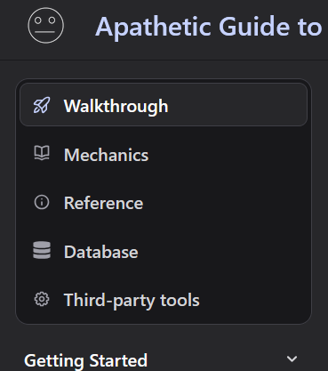

# Theming Starlight Sidebar Topics as Astro Docs

Transform your Starlight sidebar topics to match the polished sidebar style of Astro Docs.

This [snippet](https://github.com/apathetic-tools/snippets) was created by 😐 [Apathetic Tools](https://github.com/apathetic-tools), with thanks to [Astro Docs](https://docs.astro.build/) and [Hideoo](https://github.com/HiDeoo) for sharing their styles.  
<sub>Guide licensed [CC BY-NC](../../../LICENSE-CONTENT) · Code snippets [MIT](../../../LICENSE)</sub>

## Goal

[Starlight-sidebar-topics](https://starlight-sidebar-topics.netlify.app/) provides switchable sidebar groups (called *topics*) for your [Astro Starlight](https://starlight.astro.build/) documentation site.  

You may prefer the look of the [Official Astro Docs theme](https://docs.astro.build/), which is MIT licensed. It provides a more refined style than the default Starlight sidebar topics.

### From this:


### To this:


The theme features a dark recessed look with rounded corners and highlights the currently selected topic with a pill-style indicator.

## Overview

Both methods replace the CSS provided by the `starlight-sidebar-topics` integration with custom styles to achieve the look of Astro Docs. Since the official Astro docs site implements its own sidebar group switcher, this is not a 1:1 conversion.

Astro allows adding custom CSS files to your site. Starlight also lets you override specific components — even those usually managed by an integration — though doing so comes with extra work and a higher maintenance burden.

The `starlight-sidebar-topics` integration does not currently support, nor plans to support, a dedicated theming mechanism separate from the framework[^1][^2].

### Method A — Custom CSS

**Pros:**
- Single `.css` file → minimal maintenance.
- Upstream components stay untouched → you benefit from future improvements as long as HTML/CSS structure is stable.
- Low risk to site functionality since only styles are overridden.
- Logic remains compatible even if the topics API changes.

**Cons:**
- Requires advanced, brittle CSS selector logic.
- Must carefully reset or override upstream styles.
- CSS may break if upstream HTML/CSS structure changes.

> [!TIP]  
> Ideal for “lightweight theming” where you only want visual updates with minimal code maintenance.

### Method B — Components Overrides

**Pros:**
- Inline styles → stable and insulated from upstream changes.
- Full extensibility → can combine features from multiple integrations.
- Maximum control over behavior and markup (though we will only change styles).

**Cons:**
- Higher maintenance → must maintain the functionality of multiple overridden components.
- Lose automatic updates from upstream components with no easy tracking.
- Components must be updated if the topics API changes.
- Increases code duplication across your repo.

> [!TIP]  
> Best for “full control” scenarios, when you want behavior tweaks along with styling, or need major visual changes without wrestling with CSS selectors. Be aware this adds significant code maintenance.

---

Summary:
- **Custom CSS** → best when you only want styling changes with minimal maintenance.  
- **Component Overrides** → best when you need control over both styling and functionality, or want to merge features from multiple integrations.

## Using Method A  — Theming with Custom CSS

In this method, we’ll keep all upstream components intact and only add a custom stylesheet to restyle the topics switcher.

### Step 1. Register a custom stylesheet

`astro.config.mjs (.ts,etc)`
```javascript
import { defineConfig } from 'astro/config';
import starlight from '@astrojs/starlight';
import starlightSidebarTopics from 'starlight-sidebar-topics';

// https://astro.build/config
export default defineConfig({
    integrations: [starlight({
        customCss: ['./src/styles/sidebar-topics-overrides.css'],
        plugins: [starlightSidebarTopics({ 
            // your topic configuration...
        })],
	})],
});
```

> [!NOTE]  
> You may already have a `global.css` or other CSS files from integrations (e.g. Tailwind).  
> Make sure your new file comes **after them** in the order.


### Step 2. Write your overrides

There are a few things we need to do:
- Make use of the `.starlight-sidebar-topics` class to carefully overwrite the topics theme.
- Undo any styles we don't want from starlight-sidebar-topics' [Topics.astro](https://github.com/HiDeoo/starlight-sidebar-topics/blob/main/packages/starlight-sidebar-topics/components/Topics.astro)
- Add the styles from Astro Doc's [Sidebar.astro](https://github.com/withastro/docs/blob/main/src/components/starlight/Sidebar.astro), [TabbedContent.astro](https://github.com/withastro/docs/blob/main/src/components/tabs/TabbedContent.astro), [TabListItem.astro](https://github.com/withastro/docs/blob/main/src/components/tabs/TabListItem.astro).
- Resolve any conflicts, preferably by sticking to Astro Doc's source and undo'ing the topics built-in one. e.g. Both handle the bottom margin in different ways.
- Be very careful when crafting our selector priority so that our styles apply properly (this is decievingly complicated).
- Test the styles in both light and dark mode, under multiple browsers.

The `sidebar-topics-overrides.css` file below resets styles from *starlight-sidebar-topics* with overrides inspired by *Astro Docs*. 

Our example does so methodically so that you can more easily copy-paste verbatim from the source files into the overrides if something changes upstream.

> [!NOTE]
> If you prefer all the classes merged into a single set of element modifications, see our [merged sidebar-topics-overrides.css](assets/sidebar-topics-overrides-merged.css) example instead. It is much shorter but may be more difficult to maintain over long periods of time.

`src/styles/sidebar-topics-overrides.css`
```css
/**
 * Astro Docs theme port for starlight-sidebar-topics
 * 
 * Instructions:
 * - Follow the step-by-step guide below to update this file
 *
 * Inspired by Apathetic Tools · MIT
 * https://github.com/apathetic-tools/snippets/blob/main/docs/astro-starlight/topics-astro-docs-theme
 * 
 * Theme: Astro Docs · MIT
 * https://github.com/withastro/docs
 */

/**
 * Step 1. Reset HiDeoo/starlight-sidebar-topics
 *
 * Source: starlight-sidebar-topics/components/Topics.astro
 * https://github.com/HiDeoo/starlight-sidebar-topics/blob/main/packages/starlight-sidebar-topics/components/Topics.astro
 *
 * - Prefix with `.starlight-sidebar-topics` for specificity
 * - Use `ul.starlight-sidebar-topics` (not `.starlight-sidebar-topics ul`) for the root
 * - Drop `:global()` wrappers (already global CSS)
 * - Use `revert` to reset original styles where possible
 *
 * Note: `[data-theme=...]` selectors must always remain first.
 */
ul.starlight-sidebar-topics {
	/* list-style: none;
	padding: 0; */	
	list-style: revert;
	padding: revert;	
}

ul.starlight-sidebar-topics::after {
	/* content: '';
    display: block;
    margin-top: 1rem;
    height: 1px;
    border-top: 1px solid var(--sl-color-hairline-light); */

	display: none;	
}

.starlight-sidebar-topics li {	
	/* overflow-wrap: anywhere; */

	 overflow-wrap: revert;
}

.starlight-sidebar-topics li + li {
	/* margin-top: 0.25rem; */
	
	margin-top: revert;
}

.starlight-sidebar-topics a {
	/* align-items: center;
    color: var(--sl-color-white);
    display: flex;
    font-size: var(--sl-text-base);
    font-weight: 600;
    gap: 0.5rem;
    line-height: 1.5;
    padding: 0.3em 0.5rem;
    text-decoration: none; */

	align-items: revert;
    color: revert;
    display: revert;
    font-size: revert;
    font-weight: revert;
    gap: revert;
    line-height: revert;
    padding: revert;
    text-decoration: revert;
}

.starlight-sidebar-topics a:is(.starlight-sidebar-topics-current, :hover, :focus-visible) {
	/* color: var(--sl-color-accent-high); */
	
	color: revert;
}

[data-theme='light'] .starlight-sidebar-topics a.starlight-sidebar-topics-current {
	/* color: var(--sl-color-accent); */
	
	color: revert;
}

.starlight-sidebar-topics .starlight-sidebar-topics-icon {
	/* align-items: center;
	border-radius: 0.25rem;
	border: 1px solid var(--sl-color-gray-4);
	display: flex;
	justify-content: center;
	padding: 0.1875rem;
	padding: 0.25rem; */

	align-items: revert;
	border-radius: revert;
	border: revert;
	display: revert;
	justify-content: revert;
	padding: revert;
}

.starlight-sidebar-topics a:is(.starlight-sidebar-topics-current, :hover, :focus-visible) .starlight-sidebar-topics-icon {
	/* background-color: var(--sl-color-text-accent);
	border-color: var(--sl-color-text-accent);
	color: var(--sl-color-text-invert); */

	background-color: revert;
	border-color: revert;
	color: revert;
}

.starlight-sidebar-topics .starlight-sidebar-topics-badge {
	/* margin-inline-start: 0.25em; */

	margin-inline-start: revert;
}

/**
 * Step 2. Apply theme from astro/docs 
 *
 * Component #1: withastro/docs/components/starlight/Sidebar.astro
 * https://github.com/withastro/docs/blob/main/src/components/starlight/Sidebar.astro
 * - Remove Astro-only selectors: `.fallback`, `.desktop-footer`, `.sidebar-pane`
 * - Merge `.tabbed-sidebar` + `.tab-list` → `ul.starlight-sidebar-topics`
 * - `.tab-item` → `.starlight-sidebar-topics li`
 * - `.icon` → `.starlight-sidebar-topics-icon`
 * - `a[aria-selected="true"]` → `a.starlight-sidebar-topics-current`
  * - Drop `:global()` wrappers (already global CSS)
 *
 * Component #2: withastro/docs/components/tabs/TabbedContent.astro
 * Source: https://github.com/withastro/docs/blob/main/src/components/tabs/TabbedContent.astro
 * - `.tab-list` → merge into `ul.starlight-sidebar-topics`
 * - Remove `.tab-list--styled`, `.panels--styled`
 *
 * Note: add padding/margins together when merging  `.tabbed-sidebar` and `.tab-list`.
 */

/* Styles for the custom tab switcher. */
ul.starlight-sidebar-topics {
	
	/* Layout variables */
	--tab-switcher-border-width: 1px;
	--tab-switcher-padding: calc(0.25rem - var(--tab-switcher-border-width));
	--tab-item-border-radius: 0.5rem;
	--tab-switcher-border-radius: calc(
		var(--tab-item-border-radius) + var(--tab-switcher-padding) + var(--tab-switcher-border-width)
	);

	/* Color variables */
	--tab-switcher-border-color: var(--sl-color-hairline-light);
	--tab-switcher-background-color: var(--sl-color-gray-7, var(--sl-color-gray-6));
	--tab-switcher-text-color: var(--sl-color-gray-3);
	--tab-switcher-text-color--active: var(--sl-color-white);
	--tab-switcher-icon-color: var(--sl-color-gray-4);
	--tab-switcher-icon-color--active: var(--sl-color-text-accent);
	--tab-item-background-color--hover: var(--sl-color-gray-6);
	--tab-item-background-color--active: var(--sl-color-black);
}
/* Dark theme variations */
[data-theme='dark'] ul.starlight-sidebar-topics {
	--tab-switcher-text-color: var(--sl-color-gray-2);
	--tab-switcher-icon-color: var(--sl-color-gray-3);
	--tab-item-background-color--hover: var(--sl-color-gray-5);
}

@media (min-width: 50rem) {	
	/* Dark theme variations with the desktop sidebar visible */
	[data-theme='dark'] ul.starlight-sidebar-topics {		
		--tab-switcher-background-color: var(--sl-color-black);
		--tab-item-background-color--hover: var(--sl-color-gray-6);
		--tab-item-background-color--active: var(--sl-color-gray-6);
	}
}

ul.starlight-sidebar-topics {	
	border: var(--tab-switcher-border-width) solid var(--tab-switcher-border-color);
	border-radius: var(--tab-switcher-border-radius);
	display: flex;
	flex-direction: column;
	gap: 0.25rem;
	padding: var(--tab-switcher-padding);
	background-color: var(--tab-switcher-background-color);
	margin-bottom: 1.5rem;

	/* from .tab-list */
	list-style: none;
	/* padding: 0; */ /* do not need to add this to above padding since it is 0 */
}

.starlight-sidebar-topics li a {	
	border: var(--tab-switcher-border-width) solid transparent;
	border-radius: var(--tab-item-border-radius);
	display: flex;
	align-items: center;
	gap: 0.5rem;
	padding: calc(0.5rem - var(--tab-switcher-border-width));	
	background-clip: padding-box;
	line-height: var(--sl-line-height-headings);
	text-decoration: none;
	color: var(--tab-switcher-text-color);
	font-weight: 600;
}

.starlight-sidebar-topics li a:hover {	
	color: var(--tab-switcher-text-color--active);
	background-color: var(--tab-item-background-color--hover);
}
.starlight-sidebar-topics li a.starlight-sidebar-topics-current {	
	border-color: var(--tab-switcher-border-color);
	color: var(--tab-switcher-text-color--active);
	background-color: var(--tab-item-background-color--active);
}

.starlight-sidebar-topics .starlight-sidebar-topics-icon {	
	margin: 0.25rem;
	color: var(--tab-switcher-icon-color);
}
.starlight-sidebar-topics li a:hover .starlight-sidebar-topics-icon {	
	color: inherit;
}
.starlight-sidebar-topics li a.starlight-sidebar-topics-current .starlight-sidebar-topics-icon {
	color: var(--tab-switcher-icon-color--active);
}

/**
 * Step 3. Adapt for Starlight + starlight-sidebar-topics markup
 *
 * - Remove bottom margins from astro/docs (Starlight handles spacing differently)
 * - Icons are wrapped in a <div> in starlight-sidebar-topics (vs inline in astro/docs)
 *   - Default: `display: block; align-items: normal;` → adds extra height
 *   - Fix: force the `<div>` to inherit flex styles from the parent `<a>`
 */
ul.starlight-sidebar-topics {
	margin-bottom: 0;
}

.starlight-sidebar-topics li {	
	overflow-wrap: anywhere;
}

.starlight-sidebar-topics .starlight-sidebar-topics-icon {
	align-items: inherit;
	display: inherit;
	justify-content: center;
}
```

---

🎉 At this point, your site’s topics should now match the Astro Docs theme!
You’re done with the CSS-only approach.

>[!TIP]
> If your site doesn’t look like the screenshot:
> - Verify you followed each step exactly.  
> - Check for other CSS, themes, or integrations that may conflict.  
> - Still not right? See **Epilog: Getting the latest version** for the fix.

## Alternative: Using Method B — Theming with Component Overrides

This method is ideal when you need control over both styling and functionality, or want to merge features from multiple integrations. By taking ownership of upstream components, you isolate yourself from upstream changes — but this also increases your maintenance burden.

> [!WARNING]  
> This approach duplicates large portions of *starlight-sidebar-topics* into your repo. If the integration changes upstream, you’ll need to manually update your copies.

We’ll recreate **starlight-sidebar-topics’** sidebar components step by step until we reach the `Topics.astro` component where the inline styles live. That’s where we’ll inject our theme.

---

### Step 1. Prepare component overrides

Create the following files to shadow the upstream components:

| Local Path | Upstream Component |
|------------|-----------------|
| `src/overrides/Sidebar.astro` | Root Sidebar override |
| `src/components/starlight-sidebar-topics/starlight/Sidebar.astro` | StarlightSidebarTopics sidebar |
| `src/components/starlight-sidebar-topics/Topics.astro` | Topic list component with inline styles |

---

### Step 2. Override Starlight’s Sidebar

Tell Starlight to use your root `Sidebar.astro` override instead of the default.

`astro.config.mjs (.ts,etc)`
```js
import { defineConfig } from 'astro/config';
import starlight from '@astrojs/starlight';
import starlightSidebarTopics from 'starlight-sidebar-topics';

// https://astro.build/config
export default defineConfig({
    integrations: [starlight(
        components: {
            Sidebar:  './src/overrides/Sidebar.astro',
        },
        plugins: [starlightSidebarTopics({ 
            // your topic configuration...
        })],
    )],
});
```

After this step, your sidebar will be empty (or error) until we add content.

---

### Step 3. Recreate the root `Sidebar.astro`

Copy *starlight-sidebar-topics*' root [`Sidebar.astro`](https://github.com/HiDeoo/starlight-sidebar-topics/blob/main/packages/starlight-sidebar-topics/overrides/Sidebar.astro) into `src/overrides/Sidebar.astro`. No changes yet — this ensures your sidebar calls your custom components.

```jsx
---
// Inspired by Apathetic Tools and HiDeoo/starlight-sidebar-topics · MIT
// https://github.com/apathetic-tools/snippets/blob/main/docs/astro-starlight/topics-astro-docs-theme
// https://github.com/HiDeoo/starlight-sidebar-topics/blob/main/packages/starlight-sidebar-topics/overrides/Sidebar.astro

import Default from '@astrojs/starlight/components/Sidebar.astro'
import StarlightSidebarTopicsSidebar from '../components/starlight/Sidebar.astro'
---

<StarlightSidebarTopicsSidebar />
<Default><slot /></Default>
```

Regular sidebar groups may now load, but topics will still be missing.

---

### Step 4. Recreate `starlight/Sidebar.astro`

Copy *starlight-sidebar-topics'* [`starlight/Sidebar.astro`](https://github.com/HiDeoo/starlight-sidebar-topics/blob/main/packages/starlight-sidebar-topics/components/starlight/Sidebar.astro) into `src/components/starlight-sidebar-topics/starlight/Sidebar.astro`

```jsx
---
// Inspired by Apathetic Tools and HiDeoo/starlight-sidebar-topics · MIT
// https://github.com/apathetic-tools/snippets/blob/main/docs/astro-starlight/topics-astro-docs-theme
// https://github.com/HiDeoo/starlight-sidebar-topics/blob/main/packages/starlight-sidebar-topics/components/starlight/Sidebar.astro
import Topics from '../Topics.astro'

const { hasSidebar } = Astro.locals.starlightRoute
const { isPageWithTopic } = Astro.locals.starlightSidebarTopics
---

{hasSidebar && isPageWithTopic && <Topics />}
```

The sidebar may load now, but the topic list will still be empty.

### Step 5. Recreate `Topics.astro`

Copy *starlight-sidebar-topics'* [`Topics,astro`](https://github.com/HiDeoo/starlight-sidebar-topics/blob/main/packages/starlight-sidebar-topics/components/Topics.astro) into `src/components/starlight-sidebar-topics/Topics.astro`. **Keep the logic and markup identical** — we’ll change only the styling.

```jsx
---
// Inspired by Apathetic Tools and HiDeoo/starlight-sidebar-topics · MIT
// https://github.com/apathetic-tools/snippets/blob/main/docs/astro-starlight/topics-astro-docs-theme
// https://github.com/HiDeoo/starlight-sidebar-topics/blob/main/packages/starlight-sidebar-topics/components/Topics.astro
// Theme · Astro/docs · MIT: https://docs.astro.build/

import { Badge, Icon } from '@astrojs/starlight/components'

const { topics } = Astro.locals.starlightSidebarTopics
---

<ul class="starlight-sidebar-topics">
  {
    topics.map((topic) => (
      <li>
        <a href={topic.link} class:list={{ 'starlight-sidebar-topics-current': topic.isCurrent }}>
          {topic.icon && (
            <div class="starlight-sidebar-topics-icon">
              <Icon name={topic.icon} />
            </div>
          )}
          <div>
            {topic.label}
            {topic.badge && (
              <Badge class="starlight-sidebar-topics-badge" text={topic.badge.text} variant={topic.badge.variant} />
            )}
          </div>
        </a>
      </li>
    ))
  }
</ul>

<style>
/* original inline styles removed; we’ll inject our theme next */
</style>
```

---

### Step 6. Inject custom theme

Append the following styles after the <ul> block. These are adapted from Astro Docs’ theme and scoped to this component.

`src/components/starlight-sidebar-topics/Topics.astro`
```css

<style>
	.starlight-sidebar-topics {
		/* Layout variables */
		--tab-switcher-border-width: 1px;
		--tab-switcher-padding: calc(0.25rem - var(--tab-switcher-border-width));
		--tab-item-border-radius: 0.5rem;
		--tab-switcher-border-radius: calc(
			var(--tab-item-border-radius) + var(--tab-switcher-padding) + var(--tab-switcher-border-width)
		);

		/* Color variables */
		--tab-switcher-border-color: var(--sl-color-hairline-light);
		--tab-switcher-background-color: var(--sl-color-gray-7, var(--sl-color-gray-6));
		--tab-switcher-text-color: var(--sl-color-gray-3);
		--tab-switcher-text-color--active: var(--sl-color-white);
		--tab-switcher-icon-color: var(--sl-color-gray-4);
		--tab-switcher-icon-color--active: var(--sl-color-text-accent);
		--tab-item-background-color--hover: var(--sl-color-gray-6);
		--tab-item-background-color--active: var(--sl-color-black);
	}
	/* Dark theme variations */
	:global([data-theme='dark']) .starlight-sidebar-topics {
		--tab-switcher-text-color: var(--sl-color-gray-2);
		--tab-switcher-icon-color: var(--sl-color-gray-3);
		--tab-item-background-color--hover: var(--sl-color-gray-5);
	}

	@media (min-width: 50rem) {
		/* Dark theme variations with the desktop sidebar visible */
		:global([data-theme='dark']) .starlight-sidebar-topics {
			--tab-switcher-background-color: var(--sl-color-black);
			--tab-item-background-color--hover: var(--sl-color-gray-6);
			--tab-item-background-color--active: var(--sl-color-gray-6);
		}
	}

  ul {
    border: var(--tab-switcher-border-width) solid var(--tab-switcher-border-color);
		border-radius: var(--tab-switcher-border-radius);
		list-style: none;
		display: flex;
		flex-direction: column;		
		gap: 0.25rem;
		padding: var(--tab-switcher-padding);
		background-color: var(--tab-switcher-background-color);				
		margin-bottom: 0;
  }

  li {
    overflow-wrap: anywhere;
  }

  li :global(a) {
		border: var(--tab-switcher-border-width) solid transparent;
		border-radius: var(--tab-item-border-radius);
    display: flex;
		align-items: center;		
		gap: 0.5rem;
    padding: calc(0.5rem - var(--tab-switcher-border-width));
		background-clip: padding-box;
		line-height: var(--sl-line-height-headings);
		text-decoration: none;
		color: var(--tab-switcher-text-color);
		font-weight: 600;		
  }

	a:hover {
		color: var(--tab-switcher-text-color--active);
		background-color: var(--tab-item-background-color--hover);
	}
	a.starlight-sidebar-topics-current {
		border-color: var(--tab-switcher-border-color);
		color: var(--tab-switcher-text-color--active);
		background-color: var(--tab-item-background-color--active);
	}
	
		/* Icon wrapper */
  .starlight-sidebar-topics-icon {
    display: flex;		
		justify-content: center;
		align-items: center;
		margin: 0.25rem;
		color: var(--tab-switcher-icon-color);
  }  

	a:hover .starlight-sidebar-topics-icon {
		color: inherit;
	}
	a.starlight-sidebar-topics-current .starlight-sidebar-topics-icon {
		color: var(--tab-switcher-icon-color--active);
	}

  .starlight-sidebar-topics-badge {
    margin-inline-start: 0.25em;
  }
</style>
```

---

>[!TIP]
> To prevent future style conflicts, you can rename the class prefix  
> (for example, use `my-sidebar-topics` instead of `starlight-sidebar-topics`)  
> to fully isolate this component.

🎉 At this point your site’s topics should match the Astro Docs theme! You're done with the component-override approach.

>[!TIP]
> If your site doesn’t look like the screenshot:
> - Verify you followed each step exactly.  
> - Check for other CSS, themes, or integrations that may conflict.  
> - Still not right? See **Epilog: Getting the latest version** for the fix.

## Wrap-up

You’ve successfully themed your topics sidebar to match the Astro Docs style! 

- **Method A:** Quick, low-maintenance CSS overrides. Ideal if you mostly care about styles and want to stay aligned with upstream updates.  
- **Method B:** Full control via component overrides. Inline styles are resilient, but you’ll need to maintain overridden components manually.

Either approach will give your site a polished, consistent look while letting you balance control versus maintenance.

**Enjoy your newly themed sidebar!**



## Epilog: Getting the latest version

This step is optional. The guide is usually up to date, but if your styles don’t match the screenshot or you’re updating to a newer version of any theme, this section shows how to safely update your styles.

>[!TIP]
> Before updating, ensure:
> - You’ve followed the guide as-is (it’s likely current)
> - No conflicting CSS, themes, or integrations are installed

Still off? Let's update the styles to the latest version.

---

### What may have changed
- Astro Docs theme  
- Starlight theme  
- starlight-sidebar-topics theme


Each theme contains both **styles (CSS)** and **markup (HTML/Components)**, which may affect the topics sidebar.

---

### Component Structure (SST vs Astro Docs)

Our site uses **Hideoo/starlight-sidebar-topics** (SST) for topics, alongside the regular sidebar:

- [sst/overrides/Sidebar.astro](https://github.com/HiDeoo/starlight-sidebar-topics/blob/main/packages/starlight-sidebar-topics/overrides/Sidebar.astro)
  - *(topics only)* https://github.com/HiDeoo/starlight-sidebar-topics/blob/main/packages/starlight-sidebar-topics/components/starlight/Sidebar.astro
    - [sst/componeents/Topics.astro](https://github.com/HiDeoo/starlight-sidebar-topics/blob/main/packages/starlight-sidebar-topics/components/Topics.astro)
	  - *(actual topic listing)*
	  	- [starlight/user-components/Icon.astro](https://github.com/withastro/starlight/blob/main/packages/starlight/user-components/Icon.astro)
		- [starlight/user-components/Badge.astro](https://github.com/withastro/starlight/blob/main/packages/starlight/user-components/Badge.astro)
  - *(regular sidebar)* [starlight/components/Sidebar.astro](https://github.com/withastro/starlight/blob/main/packages/starlight/components/Sidebar.astro)
    - [starlight/components/SidebarPersister.astro](https://github.com/withastro/starlight/blob/main/packages/starlight/components/SidebarPersister.astro)
      - *(actual regular sidebar listing)* [starlight/components/SidebarSublist.astro](https://github.com/withastro/starlight/blob/main/packages/starlight/components/SidebarSublist.astro)


> SST topics list sits **next to** the regular sidebar; it’s not nested.

**Astro Docs (AD)** uses a different structure and has evolved organically:

- [sd/components/starlight/Sidebar.astro](https://github.com/withastro/docs/blob/main/src/components/starlight/Sidebar.astro)
  - [starlight/components/SidebarPersister.astro](https://github.com/withastro/starlight/blob/main/packages/starlight/components/SidebarPersister.astro)
    - [sd/components/tabs/TabbedContent.astro](https://github.com/withastro/docs/blob/main/src/components/tabs/TabbedContent.astro)
	  - *(topics only)* [sd/components/tabs/TabListItem.astro](https://github.com/withastro/docs/blob/main/src/components/tabs/TabListItem.astro)
	    - [starlight/user-components/Icon.astro](https://github.com/withastro/starlight/blob/main/packages/starlight/user-components/Icon.astro)
	  - *(regular sidebar)* [sd/components/tabs/TabPanel.astro](https://github.com/withastro/docs/blob/main/src/components/tabs/TabPanel.astro)
	    - *(actual regular sidebar listing)* [starlight/components/SidebarSublist.astro](https://github.com/withastro/starlight/blob/main/packages/starlight/components/SidebarSublist.astro)


> Many components pass slots and fragments down to children, which may overwrite default behavior.

---

### Markup Structure (SST vs Astro Docs)

**Hideoo/starlight-sidebar-topics** markup (our site):

```jsx
<ul class="starlight-sidebar-topics">
  <li><a>
    <div class="starlight-sidebar-topics-icon"><Icon /></div>
    <div>{label} <Badge class="starlight-sidebar-topics-badge" /></div>
  </a></li>
  <li><a class="starlight-sidebar-topics-current"><!-- ... --></a></li>
 </ul>
 <!-- regular starlight/sidebar (starlight/SidebarSublist) with inline styles ... -->
 ```

 **Astro Docs** markup:

 ```jsx
<tabbed-content class="tabbed-sidebar">
  <ul class="tab-list">
    <TabListItem class="tab-item"><li><a class="tab-link"><Icon class="icon" /> {label}</a></li></TabListItem>
    <TabListItem class="tab-item"><li><a class="tab-link" aria-selected="true"><!-- ... --></a></li></TabListItem>
  </ul>
  <div class="panels">
    <!-- regular starlight/SidebarSublist with inline styles ... -->
  </div>
</tabbed-content>
 ```

Notice: SST has `ul.starlight-sidebar-topics` controlling topics, while Astro Docs has `.tabbed-sidebar` + `ul.tab-list`. We'll need to merge these styles carefully.

---

### Mapping Strategy

**Goals:**
- Pull styles from upstream sources easily
- Minimize changes, keep them explicit 


**Approach:**
- 1. Reset HiDeoo/starlight-sidebar-topics  
- 2. Apply Astro Docs styles
- 3. Adapt for Starlight styles and starlight-sidebar-topics markup


> [!TIP]
> If you use **Method B — Theming with Component Overrides** you can skip Step 1, since the styles are already removed in overriden components.

By following this approach, you can trace upstream styles to their original markup and translate them to your own selectors. Copy-paste where possible, merge manually only when necessary.

Good luck! 🎯  

From here, the rest is up to you: explore upstream styles, map them carefully, and update your selectors as needed. With this approach, you’ll be able to safely keep your topics sidebar in sync with the latest Astro Docs theme while maintaining your customizations.

---

**📚 Inspiration and Sources**
- [Astro Docs — Custom CSS styles](https://starlight.astro.build/guides/css-and-tailwind/#custom-css-styles)
- [Astro Docs repo](https://github.com/withastro/docs)
  - [Sidebar.astro](https://github.com/withastro/docs/blob/main/src/components/starlight/Sidebar.astro)
  - [TabbedContent.astro](https://github.com/withastro/docs/blob/main/src/components/tabs/TabbedContent.astro)
  - [TabListItem.astro](https://github.com/withastro/docs/blob/main/src/components/tabs/TabListItem.astro)
- [starlight-sidebar-topics — Create a custom topic list](https://starlight-sidebar-topics.netlify.app/docs/guides/custom-topic-list/)
- [starlight-sidebar-topics repo](https://github.com/HiDeoo/starlight-sidebar-topics)
  - [Sidebar](https://github.com/HiDeoo/starlight-sidebar-topics/blob/main/packages/starlight-sidebar-topics/overrides/Sidebar.astro)
  - [StarlightSidebarTopicsSidebar](https://github.com/HiDeoo/starlight-sidebar-topics/blob/main/packages/starlight-sidebar-topics/components/starlight/Sidebar.astro)
  - [Topic](https://github.com/HiDeoo/starlight-sidebar-topics/blob/main/packages/starlight-sidebar-topics/components/Topics.astro)

[^1]: [issue #24: theming using custom CSS](https://github.com/HiDeoo/starlight-sidebar-topics/issues/24#issuecomment-2720839854)  
[^2]: [issue #38: theming using custom components](https://github.com/HiDeoo/starlight-sidebar-topics/issues/38#issuecomment-3303567297)

✨ *ChatGPT was used to help draft language, formatting, and code — plus we just love em dashes.*

<p align="center">
  <sub>😐 <a href="https://github.com/apathetic-tools">Apathetic Tools</a> © 
  Guide <a href="../../../LICENSE-CONTENT">CC&nbsp;BY-NC</a> · 
  Code <a href="../../../LICENSE">MIT</a></sub>
</p>